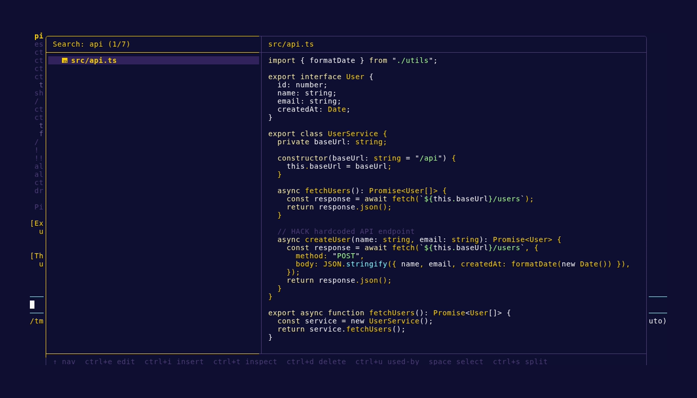
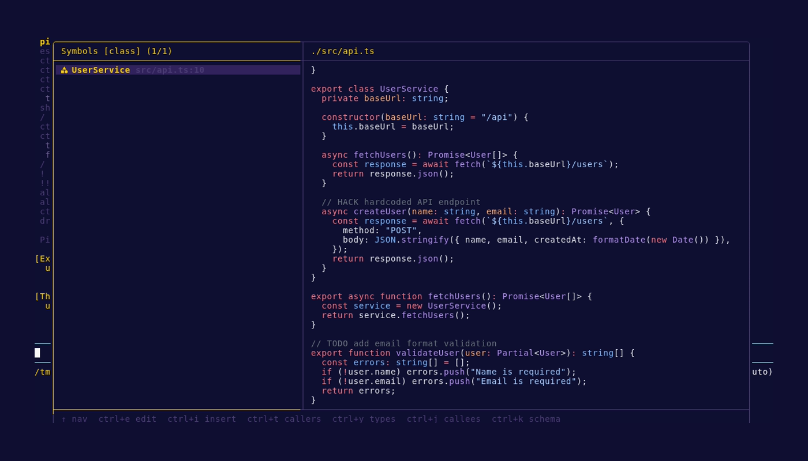
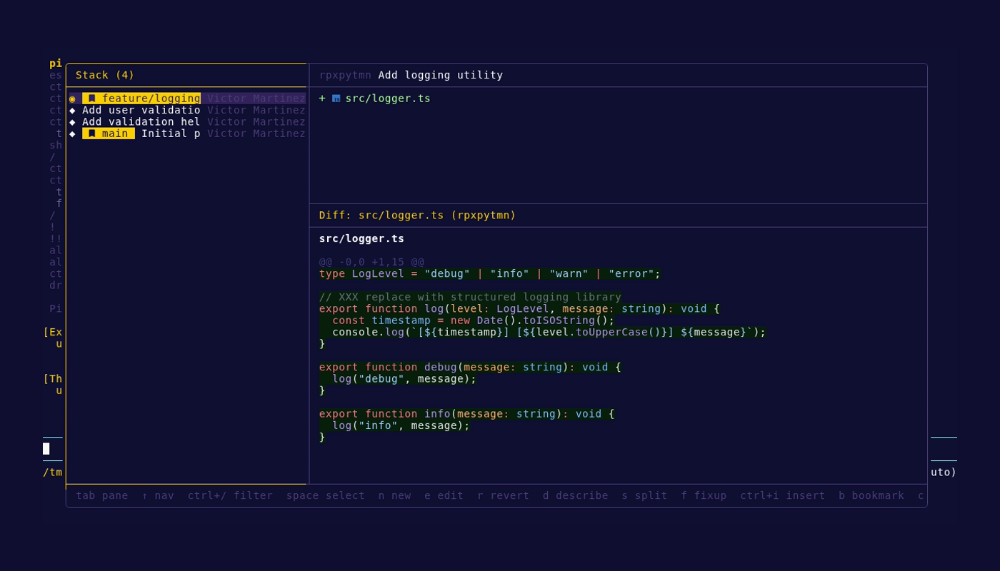
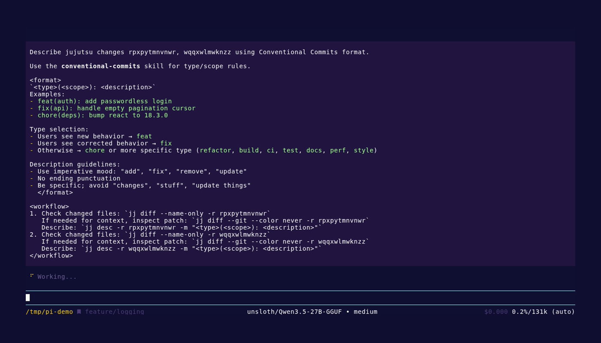
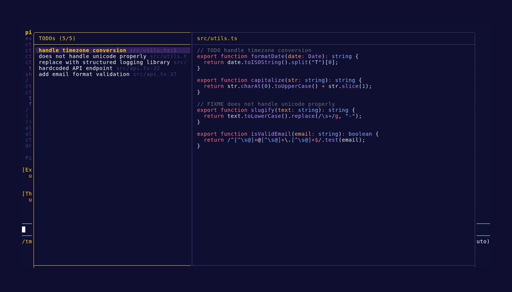
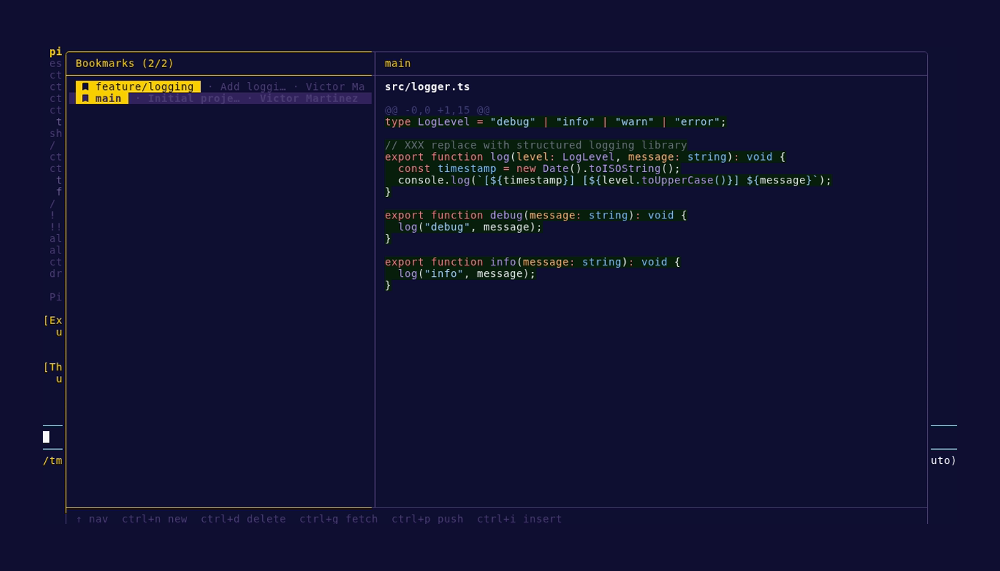
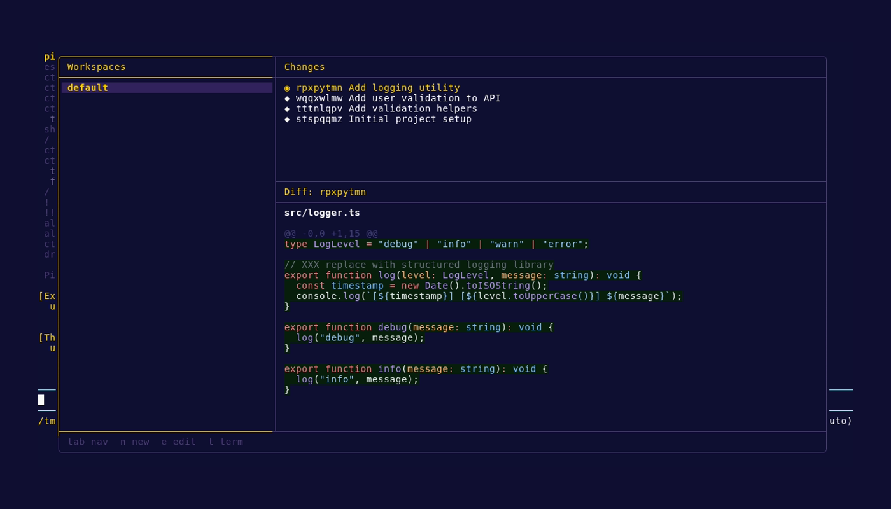
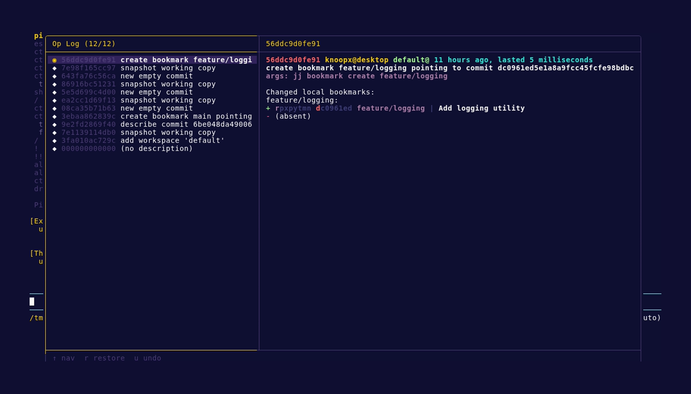

# kPI

Personal [Pi Coding Agent](https://buildwithpi.ai/) configuration with 13 extensions and 20 skills.

## Features

### IDE — TUI Development Environment

Full terminal IDE built as a pi extension: file/symbol browsing, jujutsu version control, workspace management, GitHub integration, and command palette.

**File Browser** — syntax-highlighted preview, dependency inspection, VS Code integration.

**Symbol Browser** — functions, classes, methods with source preview; callers, callees, tests, types, schema views.

**Changes** — browse mutable jujutsu changes, split/fixup/drop/reorder, describe with conventional commits, manage bookmarks.

**TODOs** — browse TODO/FIXME/HACK/XXX comments via ast-grep AST comment matching, with source preview.

**Bookmarks** — fuzzy picker, create/forget/push bookmarks, git fetch.

**Workspaces** — create isolated jj workspaces, spawn subagents via tmux, rebase and describe.

**Operation Log** — browse and restore/undo jujutsu operations.

**Skill Browser** — browse local/remote skills, preview files, install or invoke.

### Guardrails

Security hooks that intercept dangerous operations (destructive shell commands, force pushes, etc.) and require confirmation before execution. Configurable rules with default protections.

### Hooks

Run shell commands at specific lifecycle points (session start/stop, tool calls, model switches). Inspired by Claude Code hooks.

### Reverse History Search

`Ctrl+R` fuzzy search through user messages and commands across all pi sessions.

### Other Tools

- **DuckDuckGo** — web search
- **GitHub** — search repos, code, issues, PRs; browse contents and files
- **Guardrails** — security hooks for dangerous operations
- **Hooks** — lifecycle commands (session start/stop, tool calls, model switches)
- **Markitdown** — convert files and URLs to markdown
- **Nix** — search NixOS packages, options, and Home Manager config
- **Notification** — desktop notifications via notify-send
- **npm** — search packages, get info and versions
- **PyPI** — search and inspect Python packages
- **Reverse History Search** — `Ctrl+R` fuzzy search through user messages and commands
- **Turn Stats** — per-turn statistics
- **Usage** — track API usage and session costs

### Skills (20)

Reusable instruction sets: conventional-commits, gtkx, jj-hunk, jujutsu, nh, nix, nix-flakes, nu-shell, nu-shell-tabular-data, pi-logs, podman, retype, skill-authoring, tmux, transcribe-audio, typescript, uv, vhs, vicinae, vitest.

## Credits

- https://github.com/kaofelix/pi-watch/
- https://github.com/mitsuhiko/agent-stuff/
- https://github.com/tmustier/pi-extensions/
- https://github.com/laulauland/dotfiles/
- https://github.com/aliou/pi-extensions
- https://github.com/w-winter/dot314/
