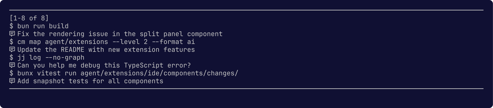

# kPI

Personal [Pi Coding Agent](https://buildwithpi.ai/) configuration with 28 extensions and 35 skills.

## Features

### IDE — TUI Development Environment

Full terminal IDE built as a pi extension: file/symbol browsing, jujutsu version control, workspace management, Linear/GitHub integration, and command palette.

**File Browser** — syntax-highlighted preview, dependency inspection, VS Code integration.

**Symbol Browser** — functions, classes, methods with source preview; callers, callees, tests, types, schema views.

**Changes** — browse mutable jujutsu changes, split/fixup/drop/reorder, describe with conventional commits, manage bookmarks.

**TODOs** — browse TODO/FIXME/HACK/XXX comments via ast-grep AST comment matching, with source preview.

**Bookmarks** — fuzzy picker, create/forget/push bookmarks, git fetch.

**Workspaces** — create isolated jj workspaces, spawn subagents via tmux, rebase and describe.

**Operation Log** — browse and restore/undo jujutsu operations.

**Skill Browser** — browse local/remote skills, preview files, install or invoke.

**Command Palette** — fuzzy-search all slash commands and shortcuts.

### Guardrails

Security hooks that intercept dangerous operations (destructive shell commands, force pushes, etc.) and require confirmation before execution. Configurable rules with default protections.

### Hooks

Run shell commands at specific lifecycle points (session start/stop, tool calls, model switches). Inspired by Claude Code hooks.

### Watch

File watcher that monitors the filesystem and triggers actions on changes. Debounced, configurable patterns.

### Reverse History Search

`Ctrl+R` fuzzy search through user messages and commands across all pi sessions.

### RAG

Markdown RAG with mdast AST chunking and semantic search. Index documentation, then query by similarity.

### Transformers.js

Local ML inference — image classification, object detection, segmentation, depth estimation, OCR, audio transcription, text-to-speech. Runs on CPU via ONNX.

### Home Assistant

List, toggle, and control Home Assistant entities. Supports lights (brightness, color), switches, climate, and arbitrary service calls.

### Usage & Turn Stats

Track API usage, session costs, context consumption, and per-turn token statistics. Provider-specific quota monitoring (Anthropic, OpenAI, Gemini, Copilot).

### Web & Search Tools

- **DuckDuckGo** — web search
- **Reddit** — browse subreddit posts (new/top/hot/rising)
- **DeepWiki** — query GitHub repo documentation via AI
- **Stocks** — Yahoo Finance market data

### Package Managers

- **npm** — search packages, get info and versions
- **PyPI** — search and inspect Python packages
- **Nix** — search NixOS packages, options, and Home Manager config

### Google Workspace (gog)

Calendar, Gmail, Drive, Docs, Contacts, and Tasks integration.

### Other Tools

- **Notification** — desktop notifications via notify-send
- **Nomnoml** — render UML diagrams from text
- **Markitdown** — convert files and URLs to markdown
- **Bookmarks** — Firefox bookmark and history search
- **Rodalies** — train departure times
- **Weather** — current weather with emoji
- **Pi Session Tools** — browse and search past sessions, tool calls, and events

### Skills (35)

Reusable instruction sets: ast-grep, bun, codemapper, conventional-commits, daily-standup, design, digest, eslint, gh, jc, jscpd, jujutsu, knip, nh, nix, nix-flakes, nomnoml, nu-shell, pi, podman, python, retype, scraping, self-improve, self-reflect, skill-authoring, swe, tmux, toon, typescript, uv, vhs, vicinae, vitest, yt-dlp.

### Prompt Templates

Pre-built prompts for common workflows: feature planning, refactoring, testing, debugging, code exploration, jujutsu operations (describe, review, split), release notes, and retrospectives.

## Credits

Code and ideas originally from:

- https://github.com/kaofelix/pi-watch/
- https://github.com/mitsuhiko/agent-stuff/
- https://github.com/tmustier/pi-extensions/
- https://github.com/laulauland/dotfiles/
- https://github.com/aliou/pi-extensions
- https://github.com/w-winter/dot314/
