# kPI

Personal [Pi Coding Agent](https://buildwithpi.ai/) configuration with 14 extensions and 28 skills.

## IDE — TUI Development Environment

Full terminal IDE built as a pi extension: file/symbol browsing, jujutsu version control, GitHub pull requests, workspace management, and operation log. Built with overlay TUIs, Shiki syntax highlighting, and keyboard-driven navigation.

### File Browser

Browse files with syntax-highlighted preview. Type to filter, enter to insert path into editor.

**Keys:** `↑/↓` navigate · `Enter` insert path · `Ctrl+I` insert path · `Ctrl+E` edit in internal editor · `Ctrl+T` inspect symbols · `Ctrl+D` remove from Codemapper index · `Ctrl+U` show used-by · `Esc` exit

### Symbol Browser

Browse code symbols (functions, classes, methods) with source preview. Enter inserts `path:line` reference.

**Keys:** `↑/↓` navigate · `Ctrl+/` cycle type filter · `Enter` insert path:line · `Ctrl+I` insert symbol name · `Ctrl+E` edit in internal editor · `Ctrl+T` callers · `Ctrl+Y` types · `Ctrl+J` callees · `Ctrl+K` schema · `Esc` exit

### Symbol References

Browse callers, callees, types, and schema for any symbol. Powered by CodeMapper AST analysis — press `Ctrl+T`/`Ctrl+Y`/`Ctrl+J`/`Ctrl+K` from the Symbol Browser to open.

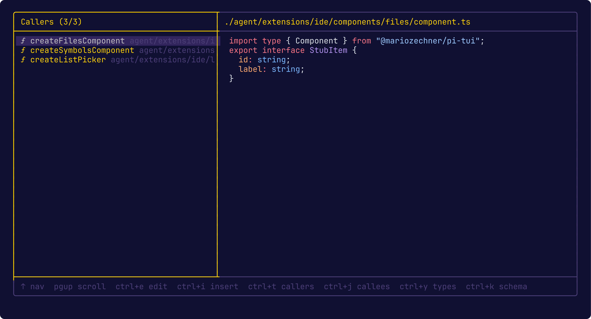

**Keys:** `↑/↓` navigate · `Enter` select symbol · `Esc` exit

### Changes

Browse all mutable jujutsu changes with file/diff preview. Split, fixup, drop, new changes, describe with conventional commits.

**Keys:** `Tab` switch focus · `↑/↓` navigate · `Ctrl+/` cycle revision filter · `Space` toggle selected · `n` new change · `e` edit · `r` revert · `d` describe · `s` split · `f` fixup · `i` insert change ID · `b` bookmark · `Ctrl+M` move mode · `Ctrl+P` push bookmarks · `Ctrl+D` drop · `Esc` exit

### Describe Workflow

Select changes with `Space`, then press `d` to generate conventional commit descriptions. Uses the `jj describe` command with semantically-generated messages.

### Move Mode

Reorder changes interactively by dragging them up/down in a split-panel view. Press `Ctrl+M` from Changes, navigate to target position with arrow keys, then `Enter` to apply or `Esc` to cancel. Powered by `jj move`.

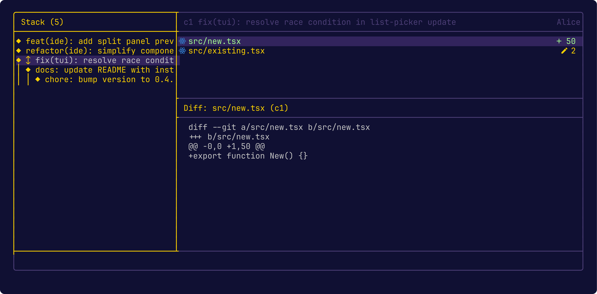

**Keys:** `↑/↓` move target · `Enter` apply · `Esc` cancel

### TODOs

Browse TODO/FIXME/HACK/XXX comments via ast-grep AST comment matching, with source preview that scrolls to the comment.

**Keys:** `↑/↓` navigate · `Enter` select · `Ctrl+T` inspect · `Ctrl+I` insert `path:line comment` · `Type` filter by text or path · `Esc` exit

### Bookmarks

Fuzzy picker for bookmarks in `name@remote` format. Create new changes from bookmarks, forget, push bookmarks (`name@remote`), git fetch.

**Keys:** `↑/↓` navigate · `Ctrl+/` cycle filter mode · `Ctrl+N` create new change from bookmark · `Ctrl+D` forget · `Ctrl+G` git fetch · `Ctrl+P` push bookmark · `Ctrl+I` insert name · `Esc` exit

### Bookmark Prompt

Fuzzy search and creation dialog for bookmarks. Press `Ctrl+N` from the Bookmarks list to open. Type to filter existing bookmarks or enter a new name to create one. Powered by `jj bookmark list`.

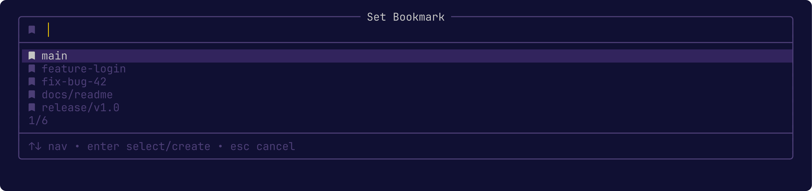

**Keys:** `↑/↓` navigate · `Type` filter/create · `Enter` select bookmark · `Esc` cancel

### Workspaces

Create isolated jj workspaces and spawn pi subagents via tmux. Rebase, describe, and manage workspace sessions.

**Keys:** `Tab` switch focus · `↑/↓` navigate · `n` new workspace + pi · `a` attach to tmux · `r` rebase & describe · `e` open in internal editor · `t` open terminal · `Ctrl+D` delete · `Esc` exit

### Pull Requests

Browse GitHub pull requests with diff preview. Uses the `gh` CLI for checkout, approve, and merge operations.

**Keys:** `↑/↓` navigate · `Enter` select · `Ctrl+O` open in browser · `Ctrl+C` checkout branch · `Ctrl+A` approve · `Ctrl+M` merge (squash) · `Ctrl+S` cycle state (open/closed/merged/all) · `Ctrl+I` insert PR reference · `Type` filter by title, author, branch, or number

### Operation Log

Browse and restore/undo jujutsu operations.

**Keys:** `↑/↓` navigate · `r` restore · `u` undo last operation · `Esc` exit

### Internal Editor

Edit files directly in the terminal with line numbers, syntax-aware pair insertion (parentheses, brackets, braces), undo/redo, comment toggling, and word-level deletion. Open from File Browser (`Ctrl+E`), Symbol Browser (`Ctrl+E`), Changes (`e` on a file), Workspaces (`e`), or Symbol References (`Enter`).

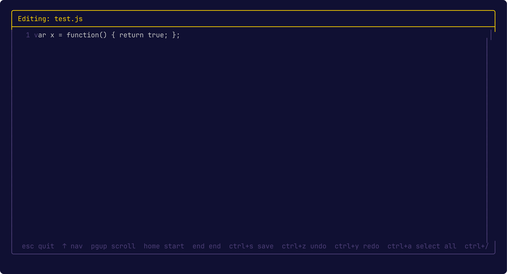

**Keys:** `↑/↓/←/→` move cursor · `PageUp/PageDown` scroll · `Home/End` line start/end · `Ctrl+S` save · `Ctrl+Z` undo · `Ctrl+Y` redo · `Ctrl+A` select all · `Ctrl+/` toggle comment · `Delete` delete forward · `Shift+Delete` delete line · `Ctrl+Backspace` delete word backward · `Ctrl+Delete` delete word forward · `Type` insert text · `Esc` exit

### Commands

| Command                  | Description                                  |
| ------------------------ | -------------------------------------------- |
| `/files [query]`         | Browse files with syntax-highlighted preview |
| `/symbols [query]`       | Browse code symbols with source preview      |
| `/todos [query]`         | Browse TODO/FIXME/HACK/XXX comments          |
| `/bookmarks`             | Browse bookmarks in `name@remote` format     |
| `/changes`               | Browse mutable jujutsu changes               |
| `/oplog`                 | Browse jujutsu operation log                 |
| `/workspaces`            | Review all workspaces                        |
| `/pull-requests`         | Browse GitHub PRs with diff preview          |
| `/workspace <task desc>` | Create jj workspace + spawn subagent         |
| `/guardrails`            | Audit guardrails config and rules            |
| `/hooks`                 | Audit hooks config and active rules          |

### Keyboard Shortcuts

| Shortcut | Action                 |
| -------- | ---------------------- |
| `Ctrl+P` | Open file picker       |
| `Ctrl+T` | Open symbol picker     |
| `Ctrl+B` | Open bookmarks browser |
| `Ctrl+J` | Open workspaces        |
| `Ctrl+K` | Open changes           |
| `Ctrl+O` | Open operation log     |
| `Ctrl+G` | Open pull requests     |
| `Ctrl+R` | Reverse history search |

### Status Footer

Rich status footer displaying working directory, VCS state (jujutsu change ID/bookmark), session name, model, API quota usage (Anthropic, OpenAI, Gemini, GitHub Copilot, Z.AI), session cost, and context window percentage. Quota refreshes every 5 minutes with color coding (green <70%, yellow 70-90%, red >90%).

## Guardrails

Security rules that block or confirm risky tool calls (destructive shell commands, force pushes, etc.). Rules match on `command`, `file_name`, or `file_content` context with optional `scope` filtering (`project`/`external`). Actions are `block` or `confirm`. Audit output shows all active groups with their rules and validation status.

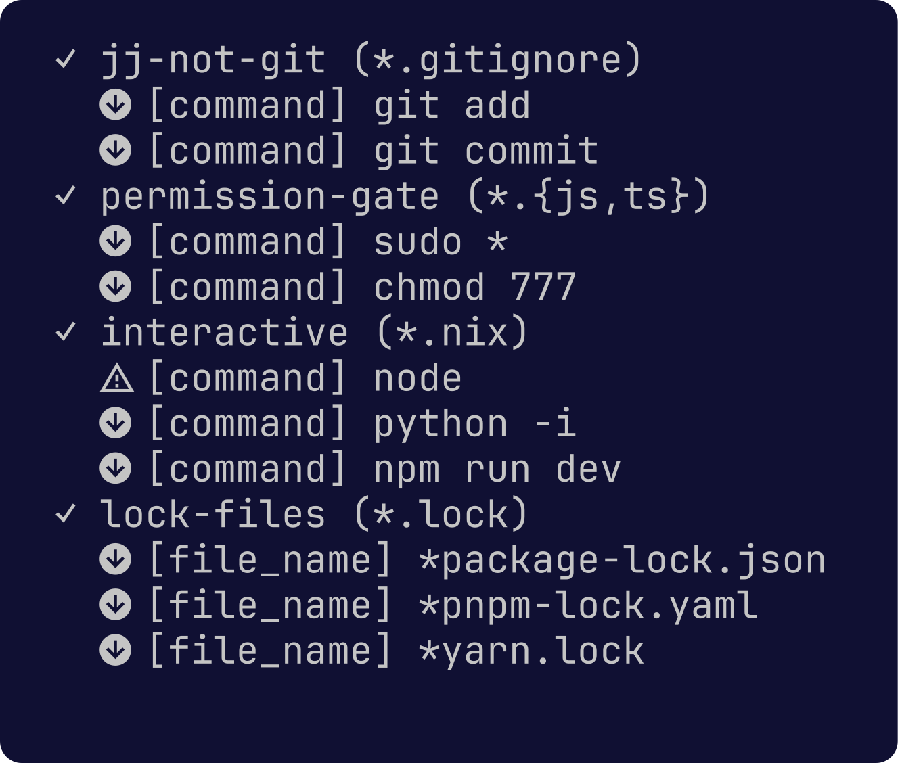

- `/guardrails` — audit config (default), or toggle with `on`/`off`

## Hooks

Run shell commands at specific lifecycle events: `session_start`, `session_shutdown`, `turn_start`, `turn_end`, `agent_start`, `agent_end`, `tool_call`, `tool_result`. Supports pattern-based matching with variable substitution (`%file%`, `%tool%`, `%cwd%`), blocking rules (exit code 2, `continue: false`, or `decision: "block"` in hook output can block any event; hook failures block on `tool_call` and `agent_end`), and audit logging.

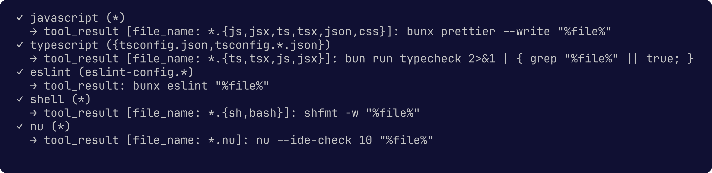

- `/hooks` — audit config (default), or toggle with `on`/`off`

## Reverse History Search

Fuzzy search through user messages and bash commands across all pi sessions. Results show bash commands (prefixed with `$`) and user messages (prefixed with `󰆉`). Sorted by recency, deduplicated, limited to 10 visible results.

**Keys:** `↑/↓` navigate · `Enter` insert result · `Esc` cancel · `Type` filter results

## Extensions

### DuckDuckGo — Web Search

Finds the DuckDuckGo preload API URL via cheerio (from `<link rel="preload">` or `<script>` tags) and fetches results. Renders formatted result tables with title, description, and URL.

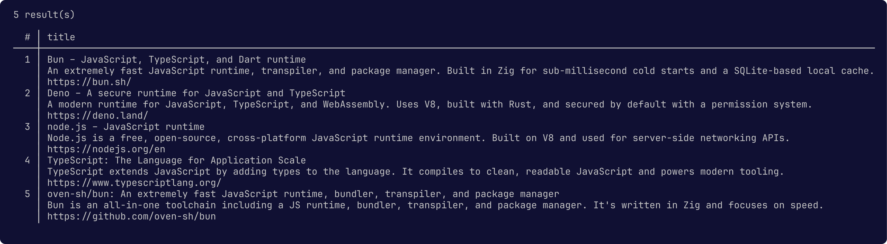

### GitHub (gh) — GitHub Integration

Search repos, code, issues, PRs; browse repository contents and files; view releases; create issues and PRs. Powered by the local `gh` CLI.

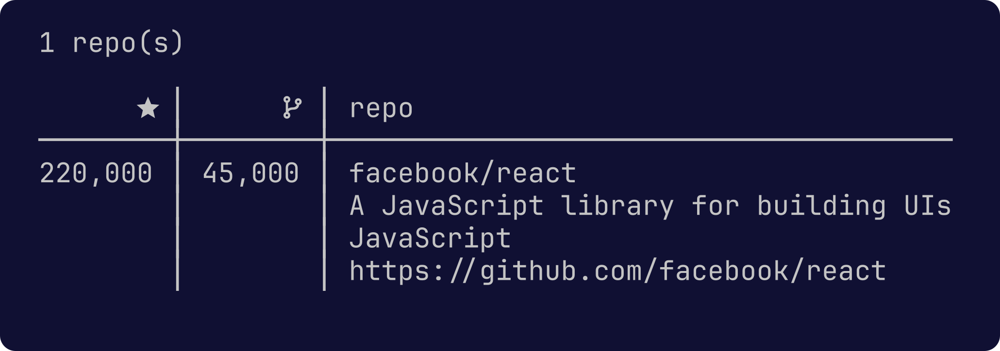

### HuggingFace — Model Search & Discussions

Search Hugging Face models with filters (tags, author, pipeline, library, date windows, gated). Lists community discussions for any model with status, comments, and reactions. Results include download counts, likes, license, and pipeline tag.

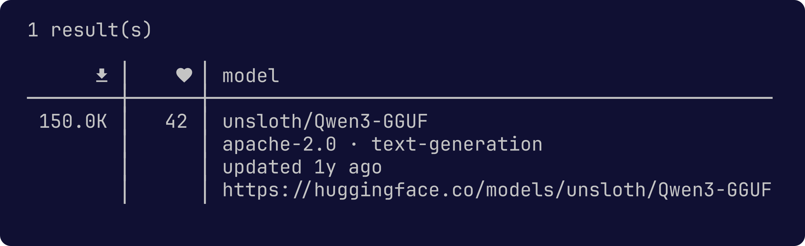

### Nix — Package & Config Search

Three tools: search NixOS packages, NixOS options, and Home Manager options. Public APIs, no installation required. Results include package version, description, license, maintainer, and source location.

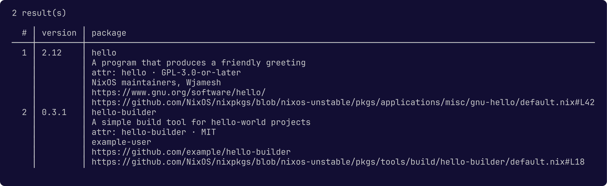

### Notification — Desktop Notifications

Desktop notifications via `notify-send` with optional TTS (text-to-speech) mode.

### Path Suggester — Semantic File Suggestions

Embeds the project file tree at session start, then matches user prompts against file paths using cosine similarity. When a prompt closely matches files in the project, relevant paths are auto-suggested inline. Configured via `pathSuggester` in `~/.pi/agent/settings.json`. Uses an OpenAI-compatible embeddings API (Ollama by default).

### npm — Package Search

Search npm packages, get package info and versions. Results include name, version, license, author, description, homepage, repository, keywords, and dependency count.

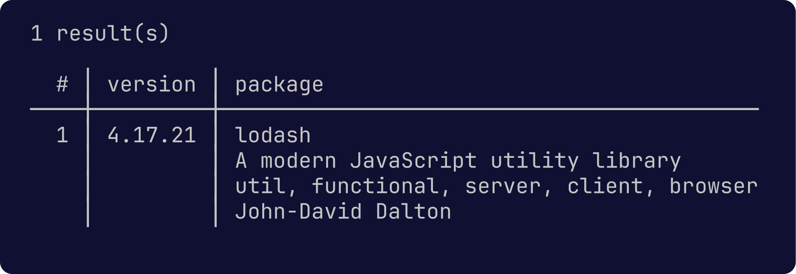

### PyPI — Python Package Search

Search Python packages from PyPI, get version metadata, dependencies, and licensing information.

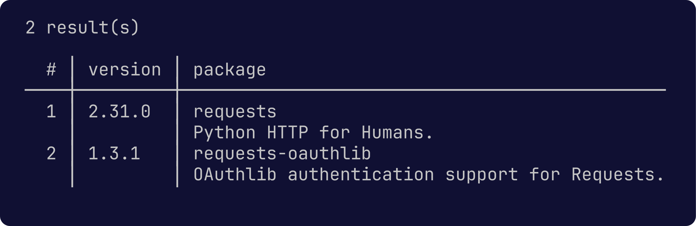

### Transcribe — File & URL to Markdown

Convert web pages and local files to clean Markdown text using the mdast ecosystem. Supports GitHub URLs (repos, PRs, issues, releases, commits), Wikipedia, arXiv, Hugging Face, Reddit, and more.

### Turn Stats — Per-Turn Telemetry

Two notifications per session: a per-turn notification (output tokens, duration, tokens/sec, cost) and an end-of-run aggregate (turn count, total input/output tokens, duration, tokens/sec, cost). Only counts assistant messages; cost omitted when < $0.005.

### Usage — Session Analytics

Interactive dashboards from session logs (`~/.pi/agent/sessions/*.jsonl`):

**Usage Dashboard** — provider/model breakdown with Today/This Week/All Time tabs.

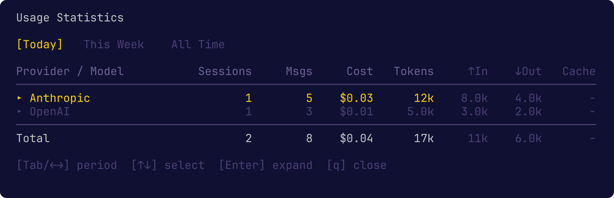

**Tool Usage** — per-tool call analytics grouped by Tool, Date, or Session.

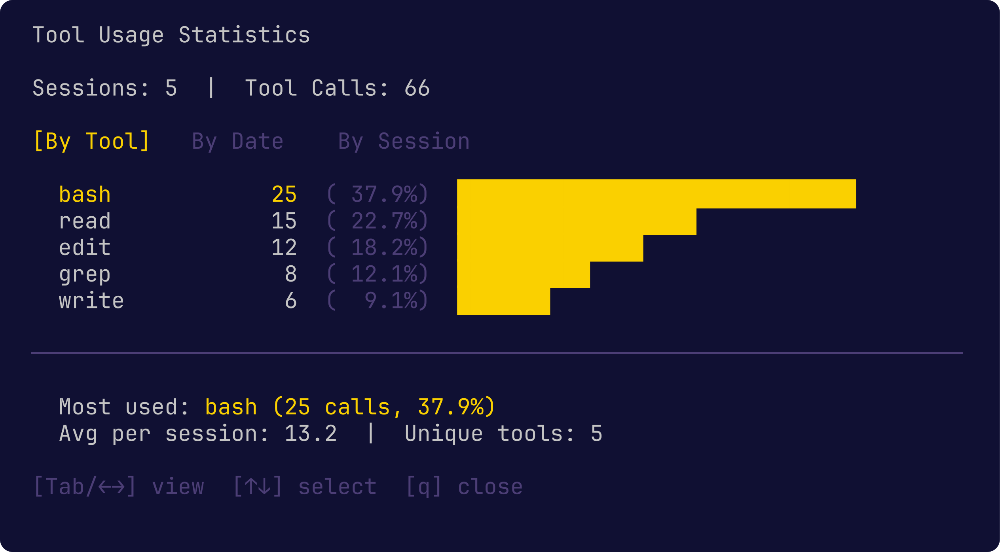

- `/usage` — provider/model usage with Today/This Week/All Time tabs (sessions, message count, cost, tokens)
- `/tool-usage` — tool call analytics by Tool/Date/Session

### Skill Reminder — Semantic Skill Discovery

Embeds all `~/.pi/agent/skills/*.md` files into a vector index and uses cosine similarity to surface relevant skills at two points:

- **Error-time** — When a tool call fails, the full invocation (tool name, all arguments) plus the error output are searched against the skill index. Matching skill snippets (with score, file path, and section) are appended to the tool result so the LLM can self-correct.
- **Prompt-time** — Before each turn, the user's prompt is embedded and matched. Relevant skills are injected into the system prompt as a `## Relevant Skills` section, priming the agent before it starts working.

Configured via `skillReminder` in `~/.pi/agent/settings.json`. Uses an OpenAI-compatible embeddings API (Ollama by default). Cache stored in `~/.cache/pi-skill-reminder/index.json`, invalidated on skill file changes.

## Skills (28)

Reusable instruction sets for specific domains:

**Development:** ast-grep, conventional-commits, gtkx, helix, jj-hunk, jujutsu, nh, nix, nix-flakes, nu-shell, pi-tui, podman, retype, typescript, uv, vhs, vicinae, vitest, vscode

**Data & System:** firefox-bookmarks, gritql, lychee, pi-logs, sem, tmux

**Agent Config:** pi-prompt-authoring, skill-authoring

**Documentation:** transcribe-audio

## Credits

- https://github.com/kaofelix/pi-watch/
- https://github.com/mitsuhiko/agent-stuff/
- https://github.com/tmustier/pi-extensions/
- https://github.com/laulauland/dotfiles/
- https://github.com/aliou/pi-extensions
- https://github.com/w-winter/dot314/
