# kPI

Personal [Pi Coding Agent](https://buildwithpi.ai/) configuration.

https://github.com/user-attachments/assets/054693ae-40b8-4ec3-88bf-7dcca312fcb1

## IDE — TUI Development Environment

Full terminal IDE built as a pi extension: file/symbol browsing, jujutsu version control, GitHub pull requests, workspace management, and operation log. Built with overlay TUIs, Shiki syntax highlighting, and keyboard-driven navigation.

### Search

Fuzzy-search across all files with syntax-highlighted source preview. Type to filter, enter to select a result.

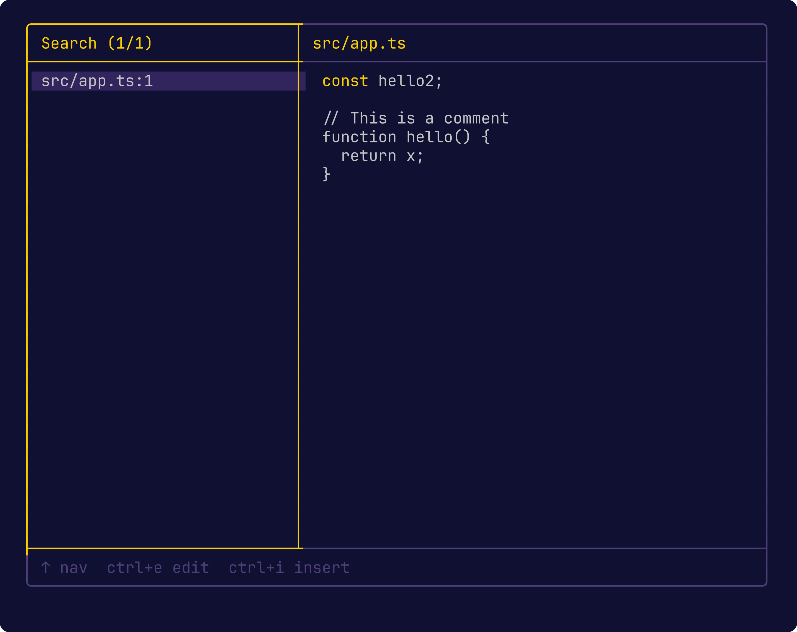

**Keys:** `↑/↓` navigate · `Enter` select result · `Ctrl+E` open in editor · `Ctrl+I` insert path:line · `PgUp/PgDn` scroll preview · `Esc` exit

### File Browser

Browse files with syntax-highlighted preview. Type to filter, enter to insert path into editor.

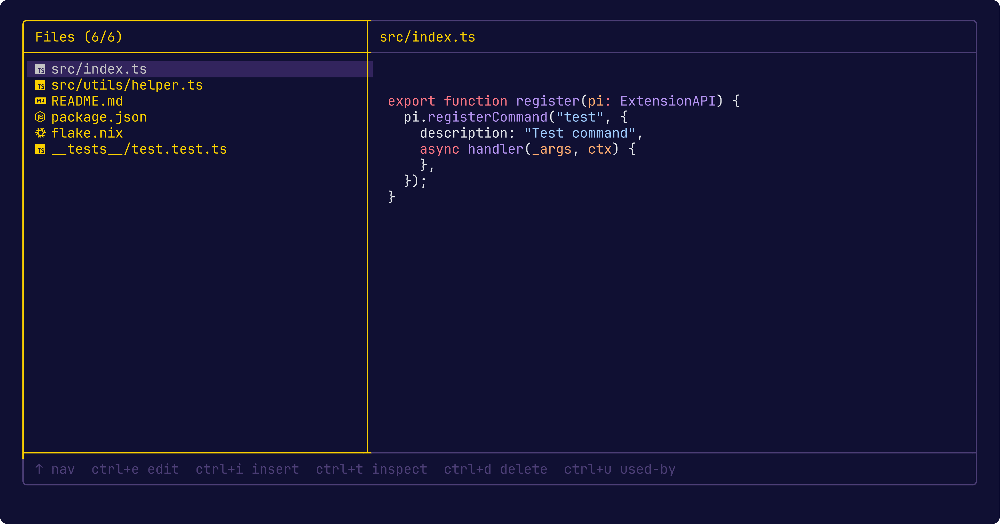

**Keys:** `↑/↓` navigate · `Enter` insert path · `Ctrl+I` insert path · `Ctrl+E` open in editor · `Ctrl+T` inspect symbols · `Ctrl+D` show dependencies · `Ctrl+U` show used-by · `Esc` exit

### Symbol Browser

Browse code symbols (functions, classes, methods) with source preview. Enter inserts `path:line` reference.

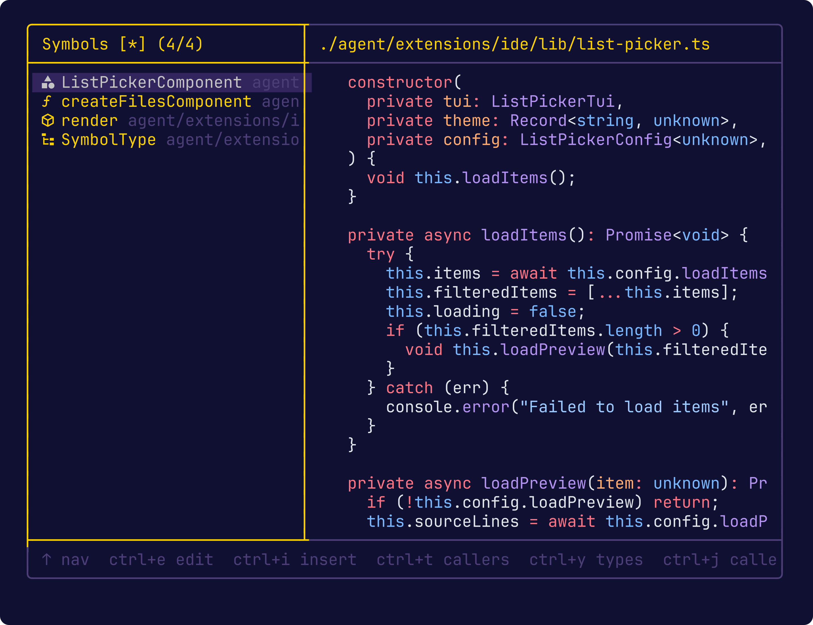

**Keys:** `↑/↓` navigate · `Ctrl+/` cycle type filter · `Enter` insert path:line · `Ctrl+I` insert symbol name · `Ctrl+E` open in editor · `Ctrl+T` callers · `Ctrl+Y` types · `Ctrl+J` callees · `Ctrl+K` schema · `Esc` exit

### Symbol References

Browse callers, callees, types, and schema for any symbol. Powered by CodeMapper AST analysis — press `Ctrl+T`/`Ctrl+Y`/`Ctrl+J`/`Ctrl+K` from the Symbol Browser to open.

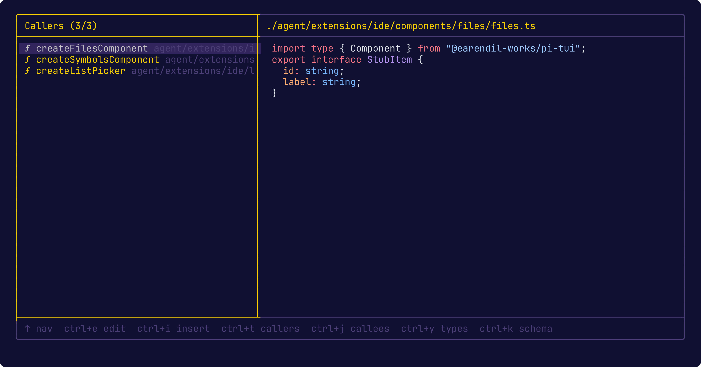

**Keys:** `↑/↓` navigate · `Enter` select symbol · `Esc` exit

### Changes

Browse all mutable jujutsu changes with file/diff preview. Split, fixup, drop, new changes, describe with conventional commits.

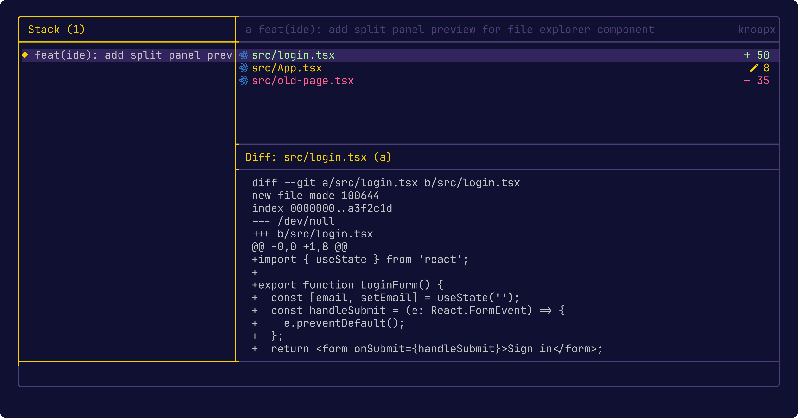

**Keys:** `Tab` switch focus · `↑/↓` navigate · `Ctrl+/` cycle revision filter · `Space` toggle selected · `n` new change · `e` edit · `r` revert · `d` describe · `s` split · `f` fixup · `i` inspect · `Ctrl+I` insert change ID · `b` bookmark · `Ctrl+M` move mode · `Ctrl+P` push bookmarks · `Ctrl+D` drop · `Esc` exit

### Describe Workflow

Select changes with `Space`, then press `d` to generate conventional commit descriptions. Uses the `jj describe` command with semantically-generated messages.

### Move Mode

Reorder changes interactively by dragging them up/down in a split-panel view. Press `Ctrl+M` from Changes, navigate to target position with arrow keys, then `Enter` to apply or `Esc` to cancel. Powered by `jj move`.

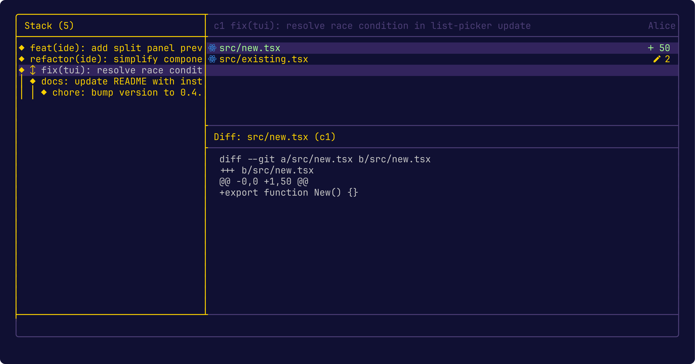

**Keys:** `↑/↓` move target · `Enter` apply · `Esc` cancel

### TODOs

Browse TODO/FIXME/HACK/XXX comments via ast-grep AST comment matching, with source preview that scrolls to the comment.

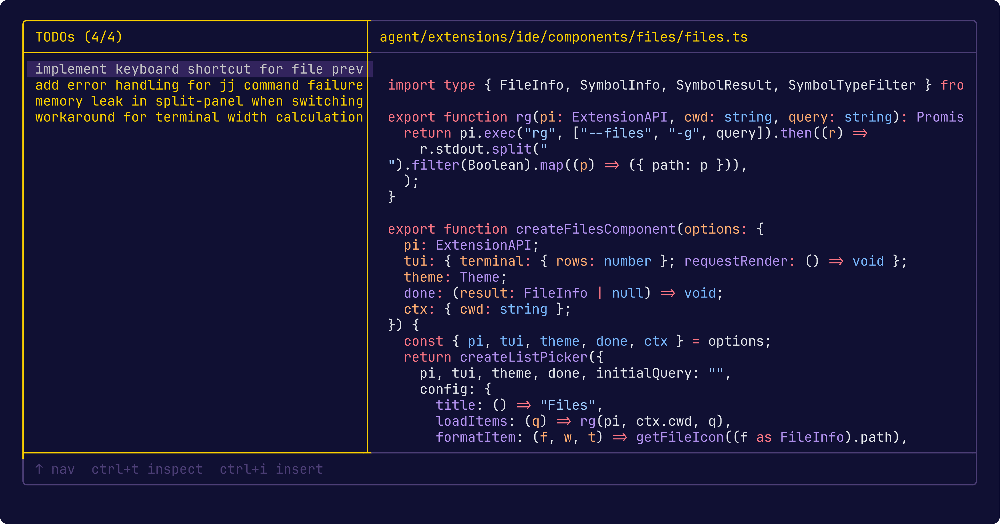

**Keys:** `↑/↓` navigate · `Enter` select · `Ctrl+T` inspect · `Ctrl+I` insert `path:line comment` · `Type` filter by text or path · `Esc` exit

### Bookmarks

Fuzzy picker for bookmarks in `name@remote` format. Create new changes from bookmarks, forget, push bookmarks (`name@remote`), git fetch.

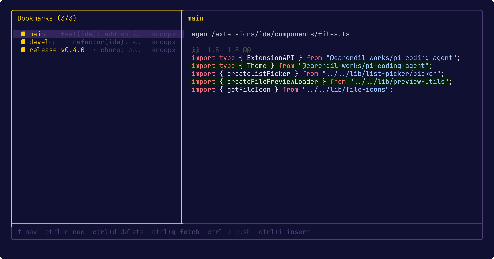

**Keys:** `↑/↓` navigate · `Ctrl+/` cycle filter mode · `Ctrl+N` create new change from bookmark · `Ctrl+D` forget · `Ctrl+G` git fetch · `Ctrl+P` push bookmark · `Ctrl+I` insert name · `Esc` exit

### Bookmark Prompt

Fuzzy search and creation dialog for bookmarks. Press `Ctrl+N` from the Bookmarks list to open. Type to filter existing bookmarks or enter a new name to create one. Powered by `jj bookmark list`.

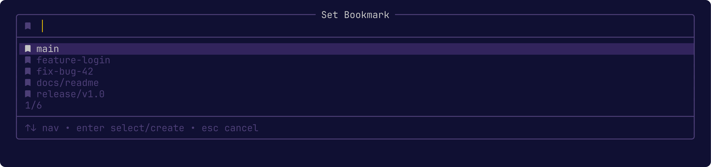

**Keys:** `↑/↓` navigate · `Type` filter/create · `Enter` select bookmark · `Esc` cancel

### Workspaces

Create isolated jj workspaces and spawn pi subagents via tmux. Rebase, describe, and manage workspace sessions.

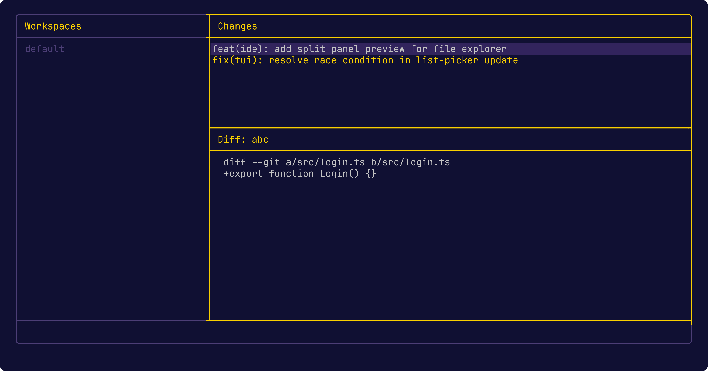

**Keys:** `Tab` switch focus · `↑/↓` navigate · `n` new workspace + pi · `a` attach to tmux · `r` rebase & describe · `e` open in editor · `t` open terminal · `Ctrl+D` delete · `Esc` exit

### Pull Requests

Browse GitHub pull requests with diff preview. Uses the `gh` CLI for checkout, approve, and merge operations.

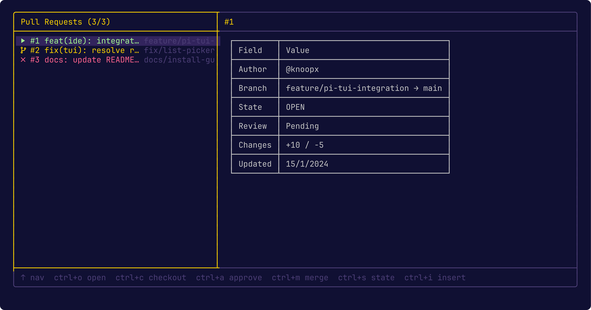

**Keys:** `↑/↓` navigate · `Enter` select · `Ctrl+O` open in browser · `Ctrl+C` checkout branch · `Ctrl+A` approve · `Ctrl+M` merge (squash) · `Ctrl+S` cycle state (open/closed/merged/all) · `Ctrl+I` insert PR reference · `Type` filter by title, author, branch, or number

### Operation Log

Browse and restore/undo jujutsu operations.

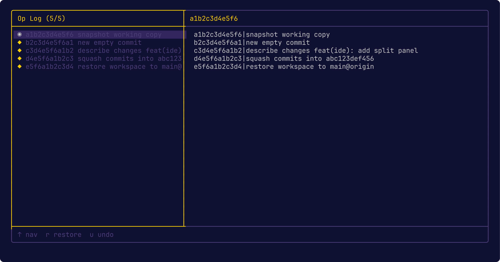

**Keys:** `↑/↓` navigate · `r` restore · `u` undo last operation · `Esc` exit

### Commands

| Command                  | Description                                       |
| ------------------------ | ------------------------------------------------- |
| `/search [query]`        | Fuzzy-search across all files with source preview |
| `/files [query]`         | Browse files with syntax-highlighted preview      |
| `/symbols [query]`       | Browse code symbols with source preview           |
| `/todos [query]`         | Browse TODO/FIXME/HACK/XXX comments               |
| `/bookmarks`             | Browse bookmarks in `name@remote` format          |
| `/changes`               | Browse mutable jujutsu changes                    |
| `/oplog`                 | Browse jujutsu operation log                      |
| `/workspaces`            | Review all workspaces                             |
| `/pull-requests`         | Browse GitHub PRs with diff preview               |
| `/workspace <task desc>` | Create jj workspace + spawn subagent              |

### Keyboard Shortcuts

| Shortcut | Action                 |
| -------- | ---------------------- |
| `Ctrl+P` | Open file picker       |
| `Ctrl+T` | Open symbol picker     |
| `Ctrl+B` | Open bookmarks browser |
| `Ctrl+J` | Open workspaces        |
| `Ctrl+K` | Open changes           |
| `Ctrl+O` | Open operation log     |
| `Ctrl+G` | Open pull requests     |
| `Ctrl+R` | Reverse history search |

### Status Footer

Rich status footer displaying working directory, VCS state (jujutsu change ID/bookmark), session name, model, API quota usage (Anthropic, OpenAI, Gemini, GitHub Copilot, Z.AI), session cost, and context window percentage. Quota refreshes every 5 minutes with color coding (green <70%, yellow 70-90%, red >90%).

## Reverse History Search

Fuzzy search through user messages and bash commands across all pi sessions. Results show bash commands (prefixed with `$`) and user messages (prefixed with `󰆉`). Sorted by recency, deduplicated, limited to 10 visible results.

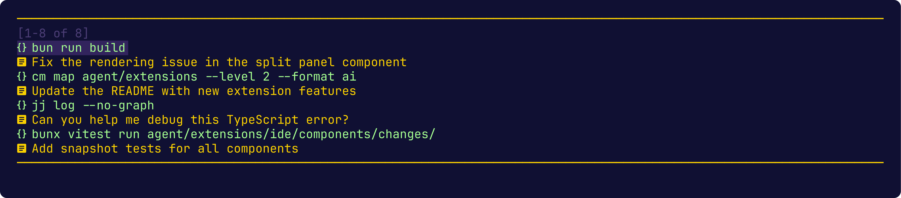

**Keys:** `↑/↓` navigate · `Enter` insert result · `Esc` cancel · `Type` filter results

## Extensions

### Change Orchestration

Enforces sequential edit lifecycle — one active edit at a time. Registers `begin-edit` and `finish-edit` tools. On each turn end, reminds the agent to call `finish-edit()` if an edit is still open. Aborted turns are skipped.

### REPL Tools

Inline code evaluation for JavaScript, Nushell, DuckDB SQL, and Python.

- `bun-repl` — evaluate JS/TS inline
- `nu-repl` — evaluate Nushell expressions
- `duckdb-repl` — evaluate SQL against in-memory database
- `python-repl` — evaluate Python code inline

### Change Orchestration

Enforces sequential edit lifecycle — one active edit at a time. Registers `begin-edit` and `finish-edit` tools that gate all file modifications. On each turn end, reminds the agent to call `finish-edit()` if an edit is still open, running verification, cleanup, and self-improvement phases before allowing the next edit.

### GitHub CLI

Full GitHub integration powered by the `gh` CLI — search repos, code, issues, and PRs. Browse repo contents, view files, manage pull requests (checkout, approve, merge), create issues, list releases and workflows, and manage gists. Mutation operations require confirmation.

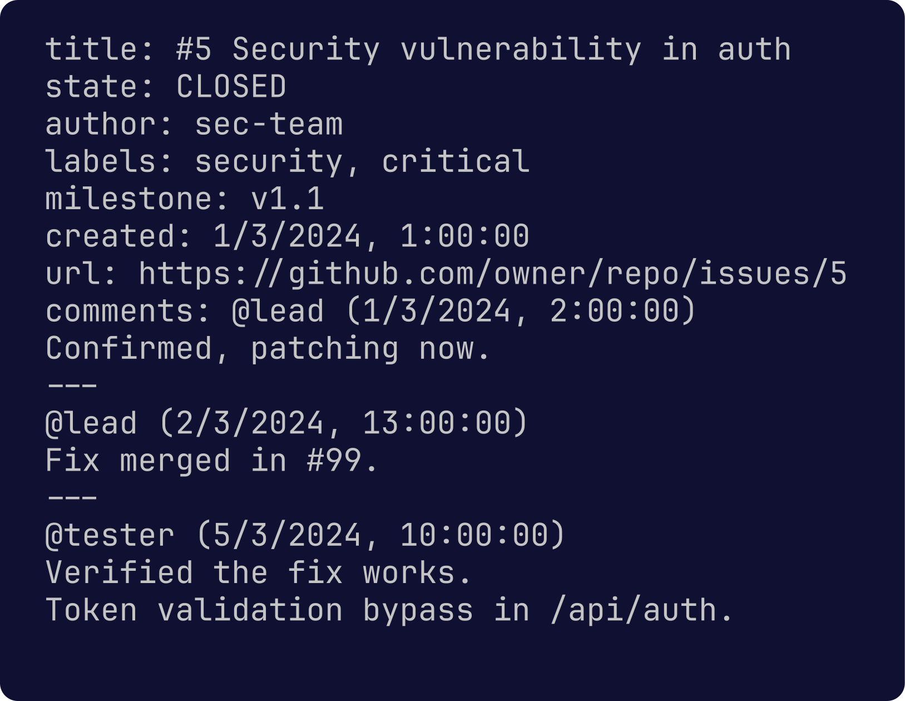

### Guardrails

Safety rules that block or require confirmation for dangerous operations before they execute. Default rules prevent running `nix search` instead of using the tool, npm/npx (use bun equivalents), direct VCS internal file access (`sudo`, `dd`, `mkfs`), wrong test runners (`bun test` vs `bun vitest run`), and git commands in jujutsu projects. Toggle with `/guardrails [on|off]`.

### Hooks

Event-driven automation that runs shell commands after tool executions. Default hooks auto-format files with prettier (JS/TS/CSS/HTML/Markdown), typecheck TypeScript changes, run eslint on lint config changes, format shell scripts with shfmt, and format Nushell scripts with nu fmt. Hooks can also block tool calls by returning denial decisions. Toggle with `/hooks [on|off]`.

### IDE

Full terminal IDE built as a pi extension: file/symbol browsing, jujutsu version control, GitHub pull requests, workspace management, and operation log. Built with overlay TUIs, Shiki syntax highlighting, and keyboard-driven navigation.

### Llama Progress

Shows a progress bar while llama.cpp processes prompts via podman-llm.service. Tails journalctl logs and parses progress updates. Widget appears after user input, hides when assistant response arrives.

### Notification

Sends desktop notifications via `notify-send` with optional TTS (text-to-speech) mode for audible alerts.

### Output Parser

Detects malformed or fenced tool calls in assistant text output — when the model embeds tool calls as text instead of using native tool calling. Logs detected calls via notifications and queues a follow-up nudge for the next turn to steer the model back onto proper tool-calling behavior.

### Path Injection

Detects directory paths mentioned in user prompts and automatically attaches `tree` output for those directories before the prompt reaches the model. The agent sees the directory structure without being asked. Notifies when trees are attached.

### REPL Tools

Inline code evaluation for JavaScript (`bun-repl`), Nushell (`nu-repl`), DuckDB SQL (`duckdb-repl`), and Python (`python-repl`). Executes code snippets and returns stdout/stderr output.

### Reverse History Search

Fuzzy search through user messages and bash commands across all pi sessions in the current directory. Sorted by recency, deduplicated. Press `Ctrl+R` to open, type to filter, enter to insert result into editor.

### Self-Correction

Monitors assistant turns and detects when the model is stuck in a loop of failed tool calls or unproductive corrections. Detects empty responses, hallucinated tools, malformed arguments, and repeated calls without explanatory text. After consecutive failures, injects a correction message to redirect the model. Resets on successful turns.

### Skillful

Keyword-based skill discovery that matches user prompts against all installed skills by scoring keyword overlap. When relevant skills are detected, their paths and descriptions are appended to the prompt. Tracks which skills have been read in the current session to avoid duplicates. Also enforces a tool gate that blocks tool calls until the corresponding skill has been read.

### Turn Stats

Per-turn and end-of-run telemetry: output tokens, duration, tokens/sec, and cost per turn. End-of-run aggregate includes turn count, total input/output tokens, and overall cost.

### Usage

Interactive dashboards from session logs (`~/.pi/agent/sessions/*.jsonl`):

- `/usage` — provider/model usage with Today/This Week/All Time tabs (sessions, message count, cost, tokens)
- `/tool-usage` — tool call analytics by Tool/Date/Session
- `/skill-usage` — skill invocation stats by Skill/Date/Session

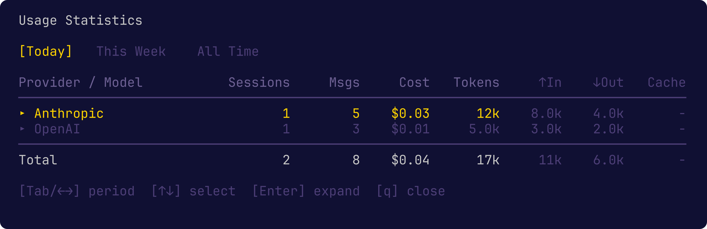

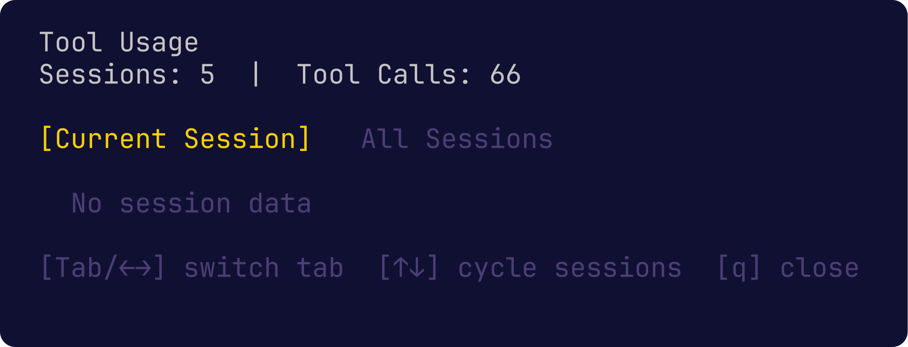

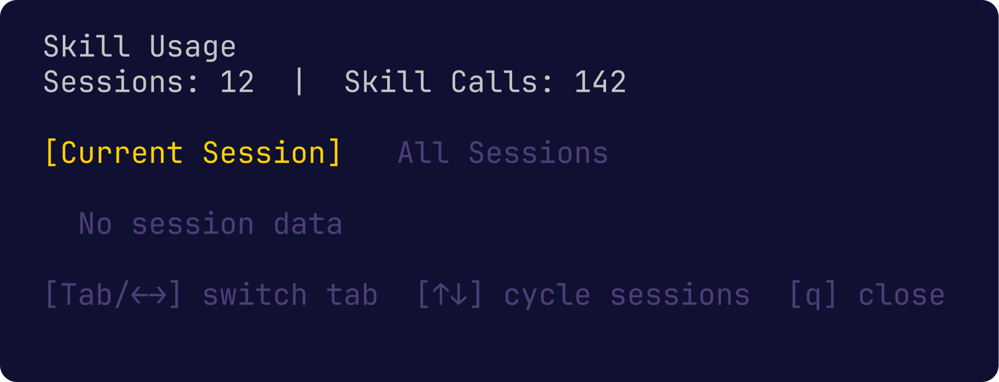

### Web Fetch

Converts web pages and local files to clean Markdown text using the mdast ecosystem. Supports GitHub URLs (repos, PRs, issues, releases, commits), Wikipedia, arXiv, Hugging Face, Reddit, and more. Results are cached for repeated access.

### Web Search

Unified search across multiple platforms — DuckDuckGo web search, npm and PyPI package registries, NixOS packages and options, Home Manager options, Hugging Face models, Sourcegraph code search across ~1M OSS repositories, and Context7 curated library documentation.

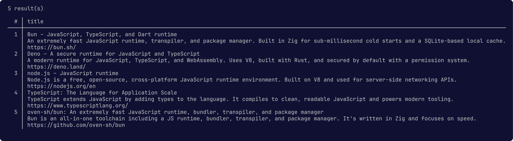

## Skills

Reusable instruction sets for specific domains:

**Development Tools:** bash, cm (CodeMapper), duckdb, edit, find, grep, grit, hx (Helix), jj-core, jj-hunk, kuva (CLI charts), lychee (link checker), nh (Nix switch), nix, nix-flake, notify, nu (Nushell), podman, read, retype (refactoring), sem (semantic analysis), sg (ast-grep), shell-session, tmux, transcribe-audio, uv, vhs (terminal recording), vitest, write

**Knowledge:** bfs-state-space, binary-search, dfs-vs-bfs, dynamic-programming, firefox-bookmarks, gtkx, hash-vs-tree, io-wrapper, markdown-rendering, pi-session-logs, pi-tui, recursion-backtracking, reporting, rule-string-transform, sorting-choice, tree-rerooting, tree-zipper, two-pointers, typescript, vicinae, vscode, workspace-docs

**Protocols:** cite-before-answer, conventional-commits, pi-prompt-authoring, research-protocol, skill-authoring, task-decomposition

## Credits

- https://github.com/kaofelix/pi-watch/
- https://github.com/mitsuhiko/agent-stuff/
- https://github.com/tmustier/pi-extensions/
- https://github.com/laulauland/dotfiles/
- https://github.com/aliou/pi-extensions
- https://github.com/w-winter/dot314/
