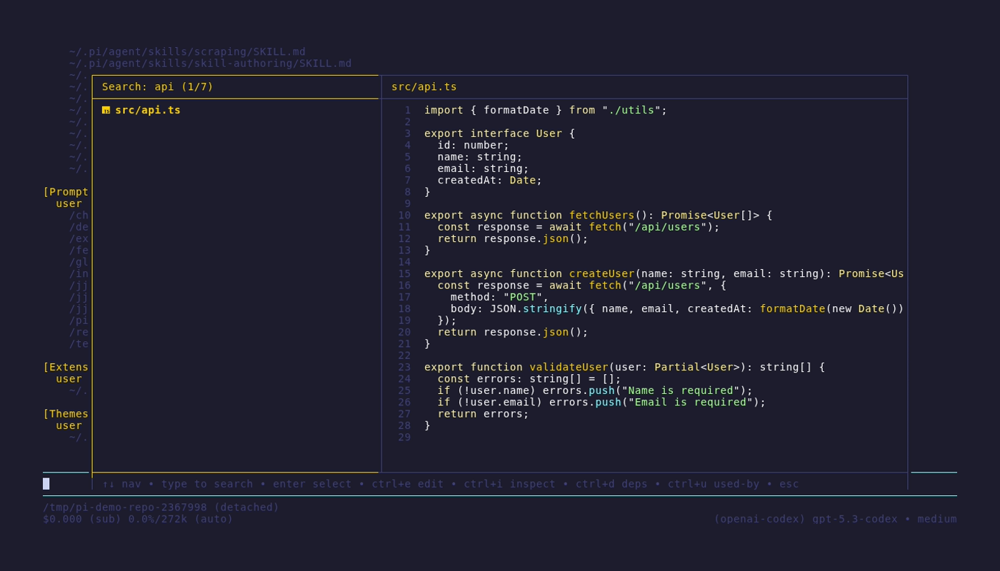
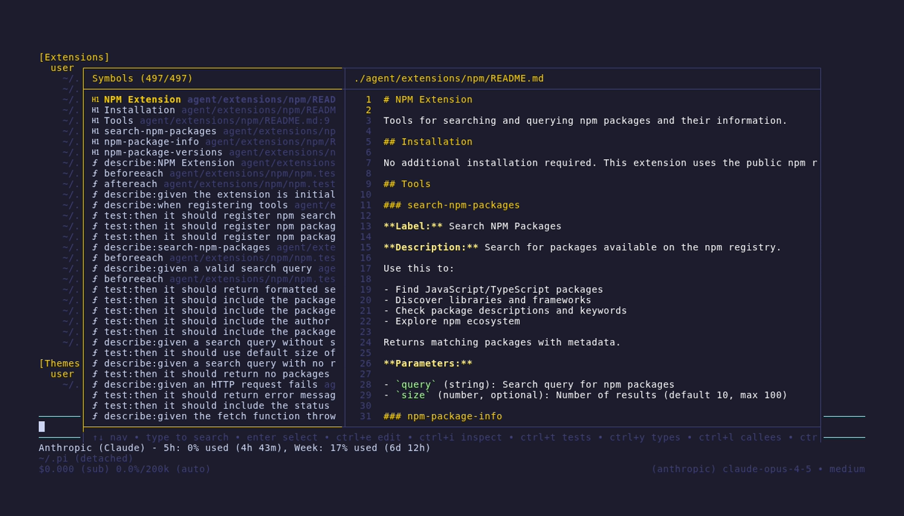
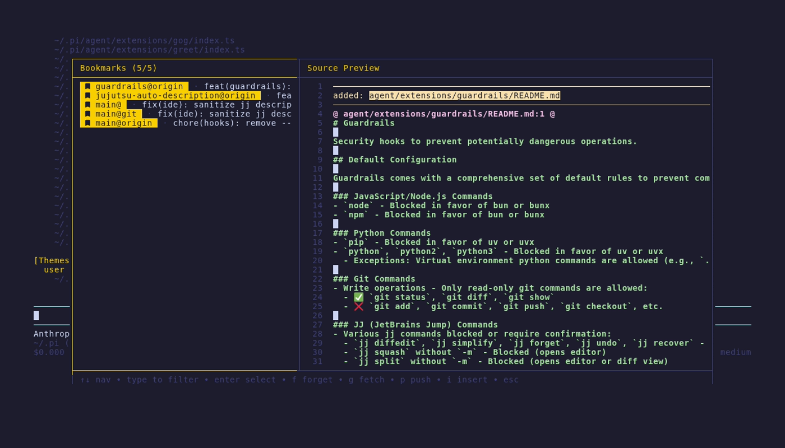
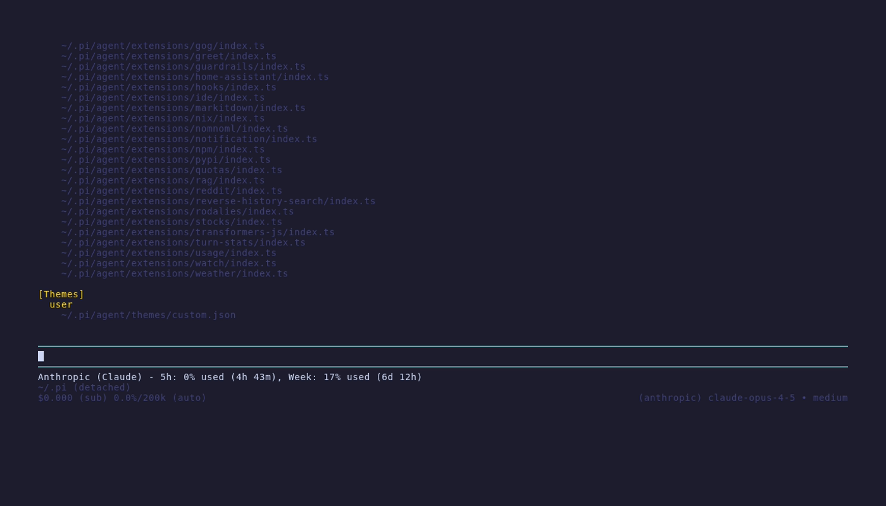
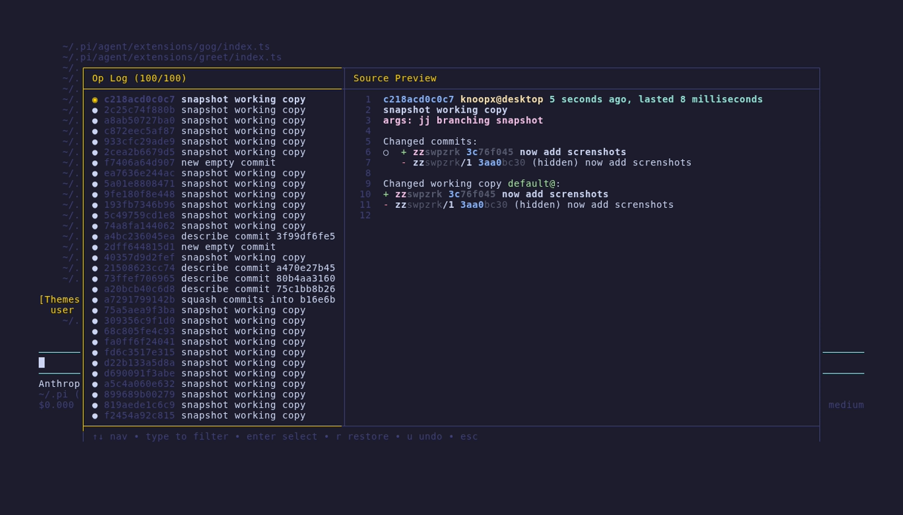
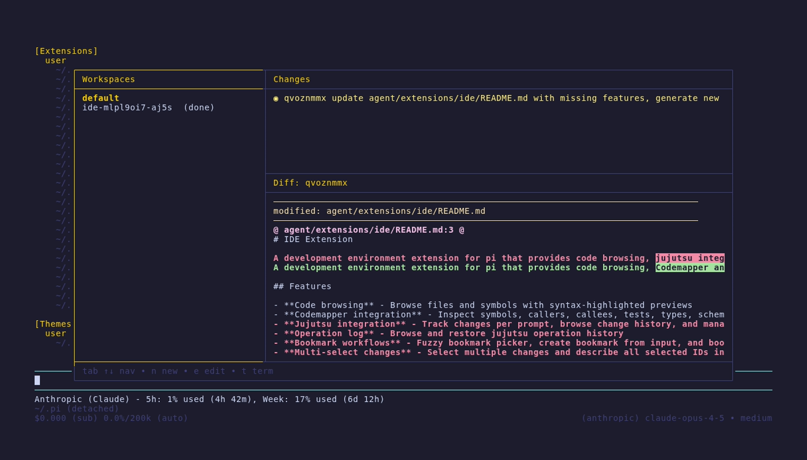

# IDE Extension

A development environment extension for pi that provides code browsing, jujutsu integration, and workspace management with split-panel TUI interfaces.

## Features

- **Code browsing** - Browse files and symbols with syntax-highlighted previews
- **Codemapper integration** - Inspect symbols, callers, callees, tests, types, schema, and impact
- **Jujutsu integration** - Track changes per prompt, browse change history, and manage bookmarks
- **Operation log** - Browse and restore jujutsu operation history
- **Bookmark workflows** - Fuzzy bookmark picker, create bookmark from input, and bookmark browser (`name@remote`)
- **Multi-select changes** - Select multiple changes and describe all selected IDs in one action
- **Workspace management** - Spawn subagents in isolated jj workspaces
- **Rich diffs** - Colorized diffs via diff-so-fancy
- **Quick navigation** - Keyboard shortcuts for fast access

## Commands

### `/files [query]`

Browse files with syntax-highlighted preview. Type to filter, enter to insert path into editor.

| Key      | Action               |
| -------- | -------------------- |
| `↑/↓`    | Navigate             |
| `Enter`  | Insert path          |
| `e`      | Open in VS Code      |
| `Ctrl+I` | Inspect file symbols |
| `Ctrl+D` | Show dependencies    |
| `Ctrl+U` | Show used-by         |
| `Esc`    | Exit                 |

### `/symbols [query]`

Browse code symbols (functions, classes, methods) with source preview. Enter inserts `path:line` reference.

| Key      | Action           |
| -------- | ---------------- |
| `↑/↓`    | Navigate         |
| `Enter`  | Insert path:line |
| `e`      | Open in VS Code  |
| `Ctrl+C` | Show callers     |
| `Ctrl+L` | Show callees     |
| `Ctrl+T` | Show tests       |
| `Ctrl+Y` | Show types       |
| `Ctrl+S` | Show schema      |
| `Ctrl+I` | Show impact      |
| `Esc`    | Exit             |

### `/bookmarks`

Browse bookmarks in `name@remote` format (`name@` for local bookmarks).

**Bookmarks pane:**
| Key | Action |
| ------- | ------------------------ |
| `↑/↓` | Navigate |
| `f` | Forget selected bookmark |
| `g` | Git fetch |
| `p` | Git push bookmark |
| `i` | Insert bookmark name |
| `Esc` | Exit |

### `/changes`

Browse mutable jujutsu changes on current branch with diff preview.

**Changes pane:**
| Key | Action |
| -------- | ------------------------------------------------- |
| `Tab` | Switch focus |
| `↑/↓` | Navigate |
| `Space` | Toggle selected change |
| `e` | Edit change |
| `d` | Describe selected changes (or focused change) |
| `f` | Fixup (squash into parent) |
| `Ctrl+D` | Drop change |
| `i` | Insert change ID |
| `b` | Set bookmark on change (fuzzy picker + create) |

**Files pane:**
| Key | Action |
| ----------- | -------------------- |
| `Tab` | Switch focus |
| `↑/↓` | Navigate |
| `e` | Open file in VS Code |
| `d` | Discard file changes |
| `Ctrl+I` | Inspect file symbols |
| `Ctrl+D` | Show file dependencies |
| `Ctrl+U` | Show file used-by |
| `PgUp/PgDn` | Scroll diff |
| `Esc` | Exit |

### `/oplog`

Browse jujutsu operation log with restore capability.

| Key   | Action               |
| ----- | -------------------- |
| `↑/↓` | Navigate             |
| `r`   | Restore to operation |
| `u`   | Undo last operation  |
| `Esc` | Exit                 |

### `/workspaces`

Review all workspaces and their changes.

**Workspaces pane:**
| Key | Action |
| ------- | ---------------------- |
| `Tab` | Switch focus |
| `↑/↓` | Navigate |
| `n` | New workspace + pi |
| `a` | Attach to tmux session |
| `r` | Rebase & describe |
| `e` | Open in VS Code |
| `t` | Open terminal |
| `x` | Delete workspace |

**Files pane:**
| Key | Action |
| ----------- | ------------------ |
| `Tab` | Switch focus |
| `↑/↓` | Navigate |
| `d` | Discard file |
| `PgUp/PgDn` | Scroll diff |
| `Esc` | Exit |

## Keyboard Shortcuts

| Shortcut | Action                 |
| -------- | ---------------------- |
| `Ctrl+P` | Open file picker       |
| `Ctrl+T` | Open symbol picker     |
| `Ctrl+B` | Open bookmarks browser |
| `Ctrl+J` | Open workspaces        |
| `Ctrl+K` | Open changes           |
| `Ctrl+O` | Open operation log     |

## Automatic Change Tracking

Each user prompt automatically creates a new jj change:

1. If current change has modifications, runs `jj new`
2. Sets the change description to the first line of the prompt

This ensures each interaction is tracked as a separate change in jj history.

## Workspace Status Icons

| Icon | Status    |
| ---- | --------- |
| ⏳   | Running   |
| ✅   | Completed |
| ❌   | Failed    |
| 💤   | Idle      |

## Dependencies

- `jj` - Jujutsu version control
- `bat` - Syntax-highlighted file preview
- `rg` - Fast file search
- `cm` - Codemapper for symbol indexing
- `diff-so-fancy` - Beautiful diff formatting
- `tmux` - Session management for subagents
