# IDE Extension

A development environment extension for pi that provides code browsing, Codemapper analysis, jujutsu workflows, and workspace management with split-panel TUI overlays.

## Features

- **Code browsing** - Browse files and symbols with syntax-highlighted previews
- **Codemapper integration** - Inspect symbols, callers, callees, tests, types, schema, and impact
- **Jujutsu integration** - Browse mutable changes, diff files, split/fixup/drop/new changes, and manage bookmarks
- **Operation log** - Browse and restore/undo jujutsu operations
- **Bookmark workflows** - Fuzzy bookmark picker, create bookmark from input, browse and push bookmarks (`name@remote`)
- **Move mode for changes** - Reorder mutable changes in the stack (`Ctrl+M`, then `↑/↓`, `Enter`)
- **Workspace management** - Create isolated jj workspaces and spawn subagents
- **Pull request browser** - Browse GitHub PRs with diff preview, checkout, approve, and merge
- **Skill browser** - Browse local/remote skills and install or insert `/skill:<name>`
- **Command palette** - Fuzzy-search slash commands and shortcuts from one overlay
- **Rich diffs** - Colorized diffs via delta
- **Quick navigation** - Keyboard shortcuts for fast access
- **Status footer** - Shows cwd, VCS state, model, API quota, context usage, and session cost
- **Session fork integration** - Auto-creates jj workspace when using `/fork`

## Commands

### `/files [query]`

Browse files with syntax-highlighted preview. Type to filter, enter to insert path into editor.

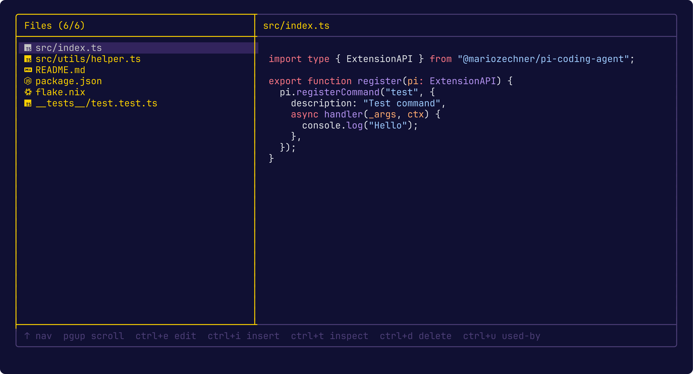

| Key      | Action               |
| -------- | -------------------- |
| `↑/↓`    | Navigate             |
| `Enter`  | Insert path          |
| `Ctrl+E` | Open in VS Code      |
| `Ctrl+I` | Inspect file symbols |
| `Ctrl+D` | Show dependencies    |
| `Ctrl+U` | Show used-by         |
| `Esc`    | Exit                 |

### `/symbols [query]`

Browse code symbols (functions, classes, methods) with source preview. Enter inserts `path:line` reference.

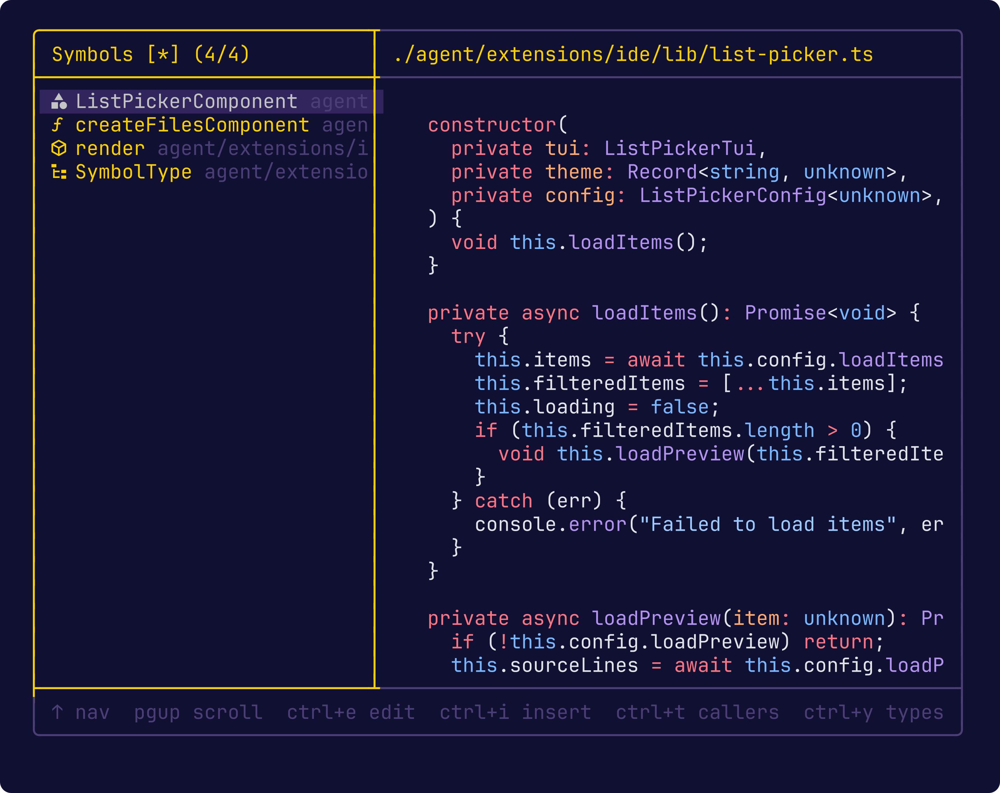

| Key      | Action            |
| -------- | ----------------- |
| `↑/↓`    | Navigate          |
| `Ctrl+/` | Cycle type filter |
| `Enter`  | Insert path:line  |
| `Ctrl+E` | Open in VS Code   |
| `Ctrl+I` | Show callers      |
| `Ctrl+L` | Show callees      |
| `Ctrl+T` | Show tests        |
| `Ctrl+Y` | Show types        |
| `Ctrl+S` | Show schema       |
| `Esc`    | Exit              |

### `/todos [query]`

Browse TODO, FIXME, HACK, and XXX comments across the codebase using ast-grep AST comment node matching. Source preview scrolls to the comment.

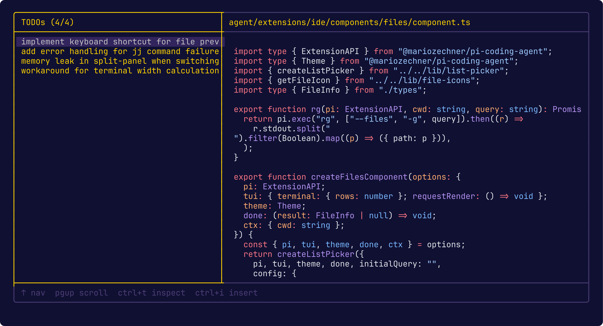

| Key      | Action                         |
| -------- | ------------------------------ |
| `↑/↓`    | Navigate                       |
| `Enter`  | Select                         |
| `Ctrl+I` | Insert `path:line comment`     |
| `Type`   | Filter by comment text or path |
| `Esc`    | Exit                           |

### `/bookmarks`

Browse bookmarks in `name@remote` format (`name@` for local bookmarks).

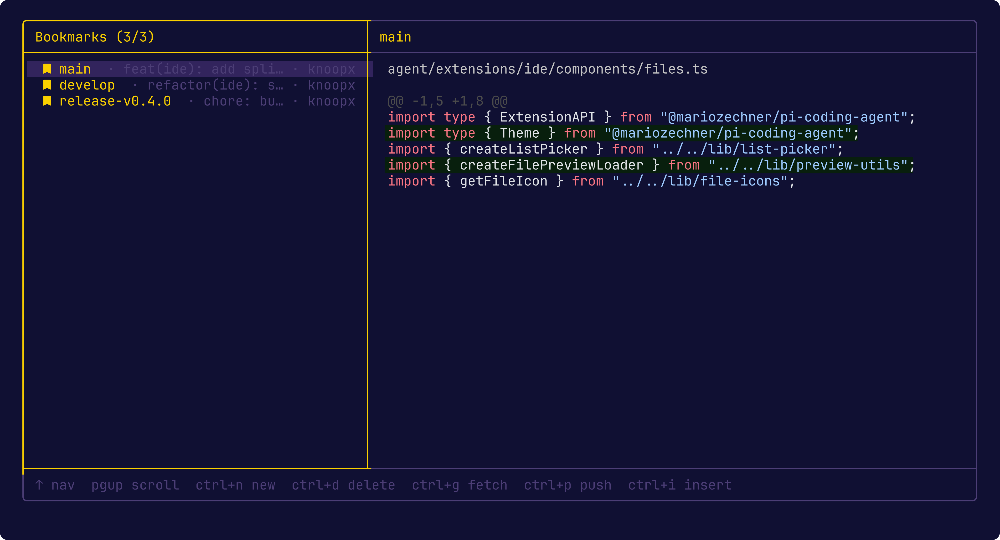

| Key      | Action               |
| -------- | -------------------- |
| `↑/↓`    | Navigate             |
| `Ctrl+/` | Cycle filter mode    |
| `Ctrl+D` | Forget bookmark      |
| `Ctrl+G` | Git fetch            |
| `Ctrl+P` | Git push bookmark    |
| `Ctrl+I` | Insert bookmark name |
| `Esc`    | Exit                 |

### `/changes`

Browse all mutable jujutsu changes with file/diff preview.

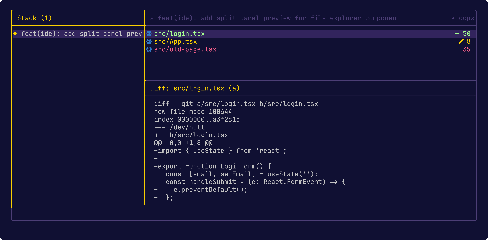

**Changes pane:**

| Key      | Action                                         |
| -------- | ---------------------------------------------- |
| `Tab`    | Switch focus                                   |
| `↑/↓`    | Navigate                                       |
| `Ctrl+/` | Cycle revision filter                          |
| `Space`  | Toggle selected change                         |
| `n`      | Create new change after selected change        |
| `e`      | Edit change                                    |
| `r`      | Revert change                                  |
| `d`      | Describe selected changes (or focused change)  |
| `s`      | Split change                                   |
| `f`      | Fixup (squash into parent)                     |
| `Ctrl+M` | Enter move mode (`↑/↓` move, `Enter` apply)    |
| `i`      | Insert change ID                               |
| `b`      | Set bookmark on change (picker + create)       |
| `Ctrl+P` | Push all bookmarks pointing to selected change |
| `Ctrl+D` | Drop change                                    |

#### Describe Workflow

Select changes with `Space`, then press `d` to generate conventional commit descriptions via the agent.

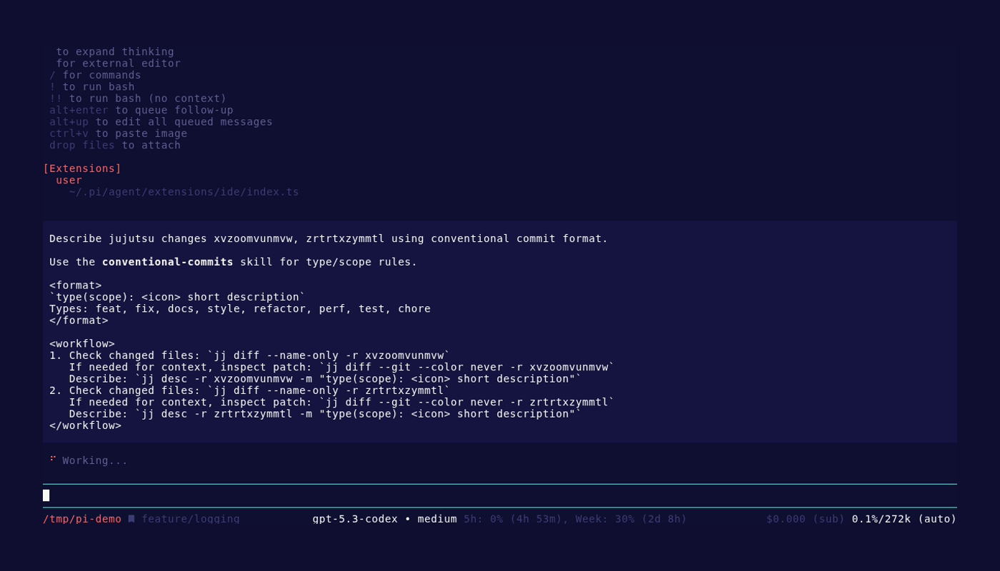

**Files pane:**

| Key         | Action                 |
| ----------- | ---------------------- |
| `Tab`       | Switch focus           |
| `↑/↓`       | Navigate               |
| `e`         | Open file in VS Code   |
| `d`         | Discard file changes   |
| `Ctrl+I`    | Inspect file symbols   |
| `Ctrl+D`    | Show file dependencies |
| `Ctrl+U`    | Show file used-by      |
| `PgUp/PgDn` | Scroll diff            |
| `Esc`       | Exit                   |

### `/oplog`

Browse jujutsu operation log with restore and undo capability.

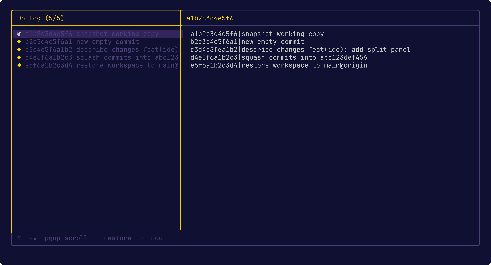

| Key   | Action               |
| ----- | -------------------- |
| `↑/↓` | Navigate             |
| `r`   | Restore to operation |
| `u`   | Undo last operation  |
| `Esc` | Exit                 |

### `/workspaces`

Review all workspaces and their changes.

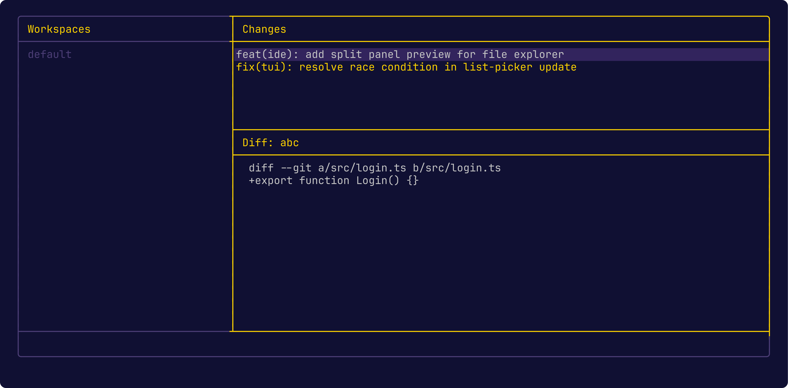

**Workspaces pane:**

| Key      | Action                 |
| -------- | ---------------------- |
| `Tab`    | Switch focus           |
| `↑/↓`    | Navigate               |
| `n`      | New workspace + pi     |
| `a`      | Attach to tmux session |
| `r`      | Rebase & describe      |
| `e`      | Open in VS Code        |
| `t`      | Open terminal          |
| `Ctrl+D` | Delete workspace       |

**Files/Changes pane:**

| Key         | Action       |
| ----------- | ------------ |
| `Tab`       | Switch focus |
| `↑/↓`       | Navigate     |
| `d`         | Discard file |
| `PgUp/PgDn` | Scroll diff  |
| `Esc`       | Exit         |

### `/skills [query]`

Browse local and remote skills, preview files, install remote skills, or insert local skill invocation.

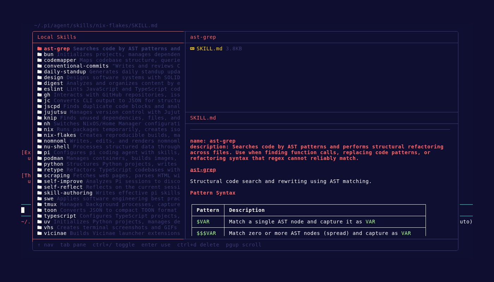

| Key         | Action                                           |
| ----------- | ------------------------------------------------ |
| `↑/↓`       | Navigate (focused pane)                          |
| `Tab`       | Switch skills/files pane                         |
| `Ctrl+/`    | Toggle local/remote view                         |
| `Enter`     | Install (remote) or insert `/skill:name` (local) |
| `Ctrl+D`    | Delete local skill                               |
| `PgUp/PgDn` | Scroll preview                                   |
| `Type`      | Filter skills                                    |
| `Esc`       | Exit                                             |

### `/commands`

Open the command palette to fuzzy-search slash commands and shortcuts.

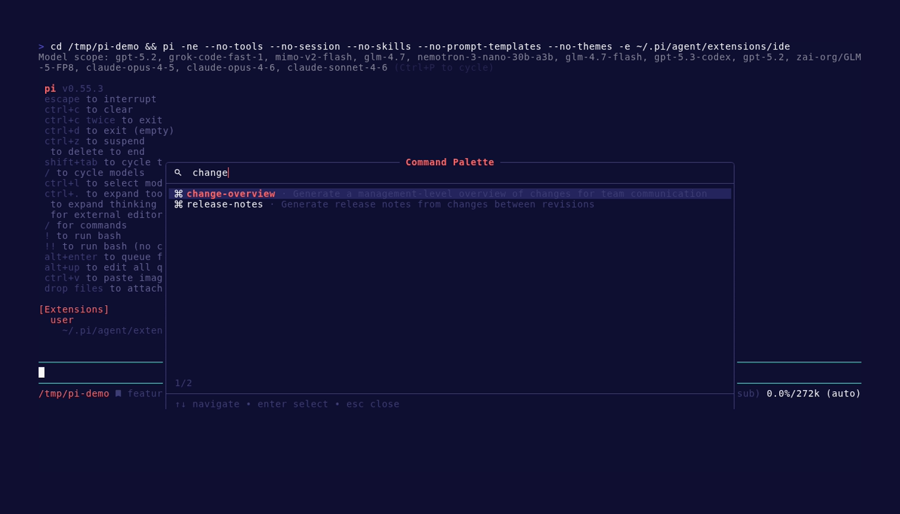

| Key         | Action         |
| ----------- | -------------- |
| `↑/↓`       | Navigate       |
| `Enter`     | Execute/select |
| `Type`      | Filter         |
| `Backspace` | Delete filter  |
| `Ctrl+U`    | Clear filter   |
| `Esc`       | Exit           |

### `/pull-requests`

Browse GitHub pull requests with diff preview. Uses the `gh` CLI for GitHub API access.

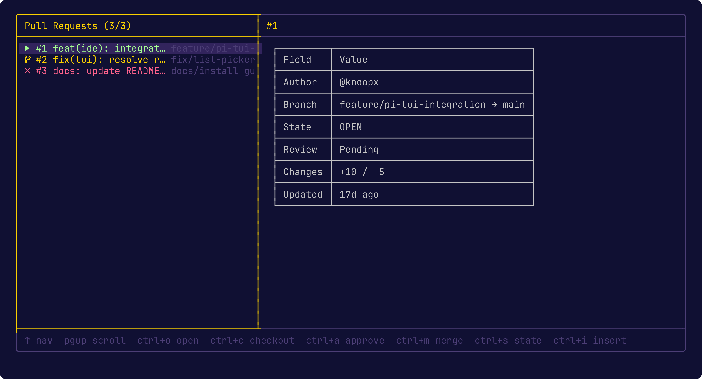

| Key      | Action                                     |
| -------- | ------------------------------------------ |
| `↑/↓`    | Navigate                                   |
| `Enter`  | Select PR                                  |
| `Ctrl+O` | Open PR in browser                         |
| `Ctrl+C` | Checkout PR branch                         |
| `Ctrl+A` | Approve PR                                 |
| `Ctrl+M` | Merge PR (squash)                          |
| `Ctrl+S` | Cycle filter (open/closed/merged/all)      |
| `Ctrl+I` | Insert PR number                           |
| `Type`   | Filter by title, author, branch, or number |
| `Esc`    | Exit                                       |

**Filters** (cycle with `Ctrl+S`):

- Open - open pull requests (default)
- Closed - closed pull requests
- Merged - merged pull requests
- All - all pull requests

### `/linear`

Browse Linear issues with markdown preview. Requires authentication via `/linear-login`.

| Key      | Action                          |
| -------- | ------------------------------- |
| `↑/↓`    | Navigate                        |
| `Enter`  | Select issue                    |
| `Ctrl+N` | Create new issue (form)         |
| `Ctrl+E` | Edit issue (form)               |
| `Ctrl+O` | Open issue in browser           |
| `Ctrl+S` | Cycle filter                    |
| `Ctrl+I` | Insert issue identifier         |
| `Type`   | Filter by title, team, or state |
| `Esc`    | Exit                            |

**Filters** (cycle with `Ctrl+S`):

- My Active - assigned to me, not completed/canceled
- My Issues - all issues assigned to me
- Created by Me - issues I created
- Urgent/High - priority 1-2 issues
- Recent - updated in last 7 days
- All - all issues

**Issue Form** (create/edit):

- `↑/↓` or `Tab` - Navigate fields
- `←/→` - Change state/priority
- `Enter` - Save issue
- `Esc` - Cancel

### `/linear-login <api-key>`

Save your Linear API key. Get your key from Linear Settings > API > Personal API keys.

### `/workspace <task description>`

Create a new jj workspace from the current change and spawn a pi subagent in that workspace.

## Keyboard Shortcuts

| Shortcut       | Action                 |
| -------------- | ---------------------- |
| `Ctrl+P`       | Open file picker       |
| `Ctrl+T`       | Open symbol picker     |
| `Ctrl+B`       | Open bookmarks browser |
| `Ctrl+J`       | Open workspaces        |
| `Ctrl+K`       | Open changes           |
| `Ctrl+O`       | Open operation log     |
| `Ctrl+S`       | Open skill browser     |
| `Ctrl+G`       | Open pull requests     |
| `Ctrl+U`       | Open Linear issues     |
| `Ctrl+Shift+P` | Open command palette   |

## Linear Tools

The following tools are available for the agent to interact with Linear:

| Tool                  | Description                             | Confirmation |
| --------------------- | --------------------------------------- | ------------ |
| `linear-search`       | Search issues by query, state, assignee | No           |
| `linear-get-issue`    | Get issue details by identifier         | No           |
| `linear-create-issue` | Create a new issue                      | Yes          |
| `linear-update-issue` | Update issue title, description, state  | Yes          |

Write operations (create, update) require user confirmation before execution.

## Automatic Change Tracking

Each interactive prompt is tracked in jj only when the first write tool is executed:

1. If current change is empty, update its description with the prompt first line.
2. Otherwise create a new change with that description (`jj new -m`).

Readonly operations (for example `read`, and readonly shell commands like `ls`, `rg`, `find`, `jj log`, `git status`) do not create a new change.

## Status Footer

The extension provides a rich status footer displaying:

| Section               | Description                                   |
| --------------------- | --------------------------------------------- |
| **Working directory** | Current directory (shortened with `~`)        |
| **VCS state**         | Jujutsu change ID and bookmark, or git branch |
| **Session name**      | Current session identifier                    |
| **Model**             | Active model ID and thinking level            |
| **API quota**         | Usage percentage for rate-limited providers   |
| **Session cost**      | Total cost for the current session            |
| **Context usage**     | Percentage of context window used             |

**API Quota Providers:**

The footer fetches quota information from:

- **Anthropic** - Claude API rate limits
- **OpenAI** - GPT API rate limits
- **Gemini** - Google AI rate limits
- **GitHub Copilot** - Copilot usage quota

Quota is refreshed every 5 minutes and displayed as percentage with color coding (green < 70%, yellow 70-90%, red > 90%).

## Session Fork Integration

When using `/fork` to create a new session, the extension automatically:

1. Creates a new jj workspace branched from the current change
2. Spawns a pi subagent in the new workspace via tmux
3. Monitors the workspace for completion

This enables parallel development workflows with isolated version control.

## Dependencies

- `jj` - Jujutsu version control
- `gh` - GitHub CLI for pull requests
- `bat` - Syntax-highlighted file preview
- `rg` - Fast file search
- `cm` - Codemapper for symbol indexing
- `delta` - Beautiful diff formatting with syntax highlighting
- `tmux` - Session management for subagents
- `code` - VS Code CLI for opening files from overlays
