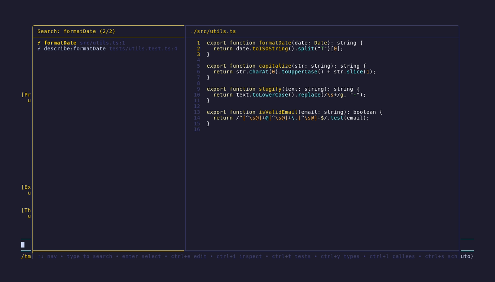
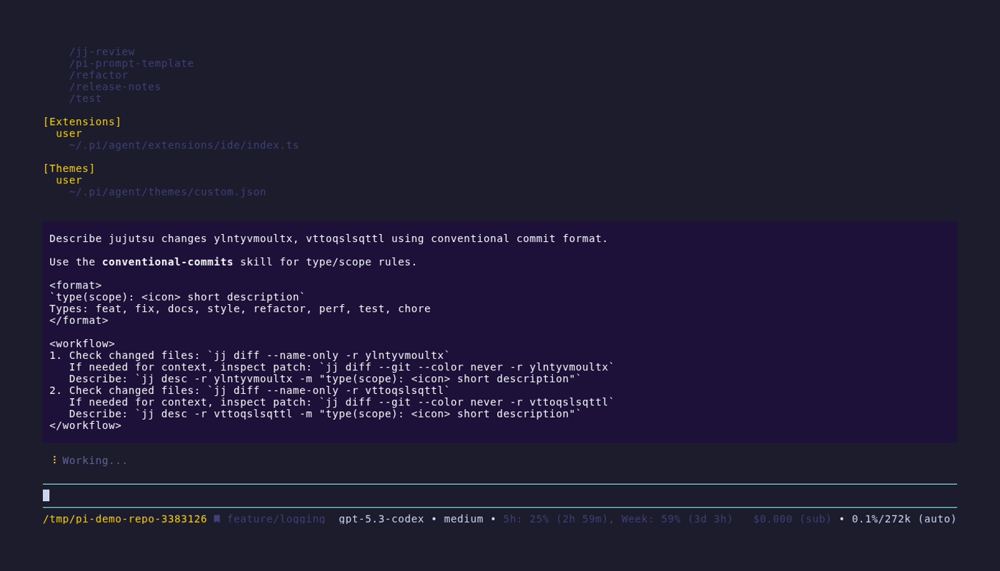
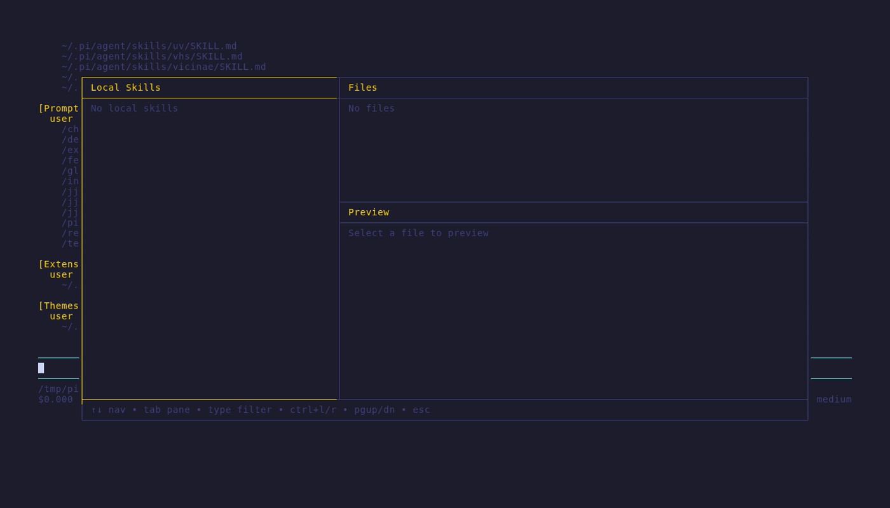
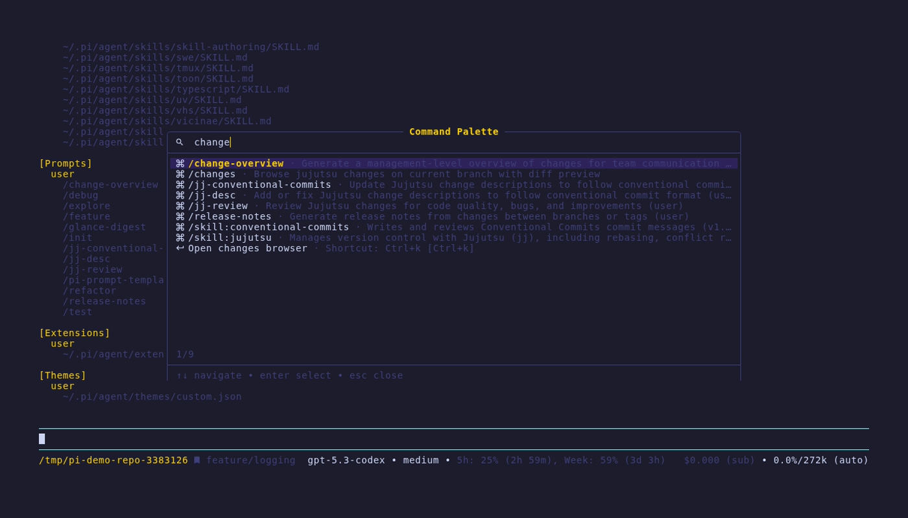

# IDE Extension

A development environment extension for pi that provides code browsing, Codemapper analysis, jujutsu workflows, and workspace management with split-panel TUI overlays.

## Features

- **Code browsing** - Browse files and symbols with syntax-highlighted previews
- **Codemapper integration** - Inspect symbols, callers, callees, tests, types, schema, and impact
- **Jujutsu integration** - Browse mutable changes, diff files, split/fixup/drop/new changes, and manage bookmarks
- **Operation log** - Browse and restore/undo jujutsu operations
- **Bookmark workflows** - Fuzzy bookmark picker, create bookmark from input, browse and push bookmarks (`name@remote`)
- **Move mode for changes** - Reorder mutable changes in the stack (`Ctrl+M`, then `↑/↓`, `Enter`)
- **Workspace management** - Create isolated jj workspaces and spawn subagents
- **Skill browser** - Browse local/remote skills and install or insert `/skill:<name>`
- **Command palette** - Fuzzy-search slash commands and shortcuts from one overlay
- **Rich diffs** - Colorized diffs via diff-so-fancy
- **Quick navigation** - Keyboard shortcuts for fast access

## Commands

### `/files [query]`

Browse files with syntax-highlighted preview. Type to filter, enter to insert path into editor.

| Key      | Action               |
| -------- | -------------------- |
| `↑/↓`    | Navigate             |
| `Enter`  | Insert path          |
| `e`      | Open in VS Code      |
| `Ctrl+I` | Inspect file symbols |
| `Ctrl+D` | Show dependencies    |
| `Ctrl+U` | Show used-by         |
| `Esc`    | Exit                 |

### `/symbols [query]`

Browse code symbols (functions, classes, methods) with source preview. Enter inserts `path:line` reference.

| Key      | Action           |
| -------- | ---------------- |
| `↑/↓`    | Navigate         |
| `Enter`  | Insert path:line |
| `e`      | Open in VS Code  |
| `Ctrl+C` | Show callers     |
| `Ctrl+L` | Show callees     |
| `Ctrl+T` | Show tests       |
| `Ctrl+Y` | Show types       |
| `Ctrl+S` | Show schema      |
| `Ctrl+I` | Show impact      |
| `Esc`    | Exit             |

#### Symbol Callers

Press `Ctrl+C` on a symbol to view all callers with source preview.

### `/bookmarks`

Browse bookmarks in `name@remote` format (`name@` for local bookmarks).

**Bookmarks pane:**

| Key   | Action                   |
| ----- | ------------------------ |
| `↑/↓` | Navigate                 |
| `f`   | Forget selected bookmark |
| `g`   | Git fetch                |
| `p`   | Git push bookmark        |
| `i`   | Insert bookmark name     |
| `Esc` | Exit                     |

### `/changes`

Browse all mutable jujutsu changes with file/diff preview.

**Changes pane:**

| Key      | Action                                         |
| -------- | ---------------------------------------------- |
| `Tab`    | Switch focus                                   |
| `↑/↓`    | Navigate                                       |
| `Space`  | Toggle selected change                         |
| `e`      | Edit change                                    |
| `d`      | Describe selected changes (or focused change)  |
| `s`      | Split change                                   |
| `n`      | Create new change after selected change        |
| `f`      | Fixup (squash into parent)                     |
| `Ctrl+M` | Enter move mode (`↑/↓` move, `Enter` apply)    |
| `Ctrl+D` | Drop change                                    |
| `i`      | Insert change ID                               |
| `b`      | Set bookmark on change (picker + create)       |
| `Ctrl+P` | Push all bookmarks pointing to selected change |

#### Describe Workflow

Select changes with `Space`, then press `d` to generate conventional commit descriptions via the agent.

**Files pane:**

| Key         | Action                 |
| ----------- | ---------------------- |
| `Tab`       | Switch focus           |
| `↑/↓`       | Navigate               |
| `e`         | Open file in VS Code   |
| `d`         | Discard file changes   |
| `Ctrl+I`    | Inspect file symbols   |
| `Ctrl+D`    | Show file dependencies |
| `Ctrl+U`    | Show file used-by      |
| `PgUp/PgDn` | Scroll diff            |
| `Esc`       | Exit                   |

### `/oplog`

Browse jujutsu operation log with restore and undo capability.

| Key   | Action               |
| ----- | -------------------- |
| `↑/↓` | Navigate             |
| `r`   | Restore to operation |
| `u`   | Undo last operation  |
| `Esc` | Exit                 |

### `/workspaces`

Review all workspaces and their changes.

**Workspaces pane:**

| Key   | Action                 |
| ----- | ---------------------- |
| `Tab` | Switch focus           |
| `↑/↓` | Navigate               |
| `n`   | New workspace + pi     |
| `a`   | Attach to tmux session |
| `r`   | Rebase & describe      |
| `e`   | Open in VS Code        |
| `t`   | Open terminal          |
| `x`   | Delete workspace       |

**Files/Changes pane:**

| Key         | Action       |
| ----------- | ------------ |
| `Tab`       | Switch focus |
| `↑/↓`       | Navigate     |
| `d`         | Discard file |
| `PgUp/PgDn` | Scroll diff  |
| `Esc`       | Exit         |

### `/skills [query]`

Browse local and remote skills, preview files, install remote skills, or insert local skill invocation.

| Key         | Action                                           |
| ----------- | ------------------------------------------------ |
| `↑/↓`       | Navigate (focused pane)                          |
| `Tab`       | Switch skills/files pane                         |
| `Enter`     | Install (remote) or insert `/skill:name` (local) |
| `x`         | Delete local skill                               |
| `Ctrl+L`    | Switch to local skills                           |
| `Ctrl+R`    | Switch to remote skills                          |
| `PgUp/PgDn` | Scroll preview                                   |
| `Type`      | Filter skills                                    |
| `Esc`       | Exit                                             |

### `/commands`

Open the command palette to fuzzy-search slash commands and shortcuts.

| Key         | Action         |
| ----------- | -------------- |
| `↑/↓`       | Navigate       |
| `Enter`     | Execute/select |
| `Type`      | Filter         |
| `Backspace` | Delete filter  |
| `Ctrl+U`    | Clear filter   |
| `Esc`       | Exit           |

### `/workspace <task description>`

Create a new jj workspace from the current change and spawn a pi subagent in that workspace.

## Keyboard Shortcuts

| Shortcut       | Action                 |
| -------------- | ---------------------- |
| `Ctrl+P`       | Open file picker       |
| `Ctrl+T`       | Open symbol picker     |
| `Ctrl+B`       | Open bookmarks browser |
| `Ctrl+J`       | Open workspaces        |
| `Ctrl+K`       | Open changes           |
| `Ctrl+O`       | Open operation log     |
| `Ctrl+S`       | Open skill browser     |
| `Ctrl+Shift+P` | Open command palette   |

## Automatic Change Tracking

Each interactive prompt is tracked in jj only when the first write tool is executed:

1. If current change is empty, update its description with the prompt first line.
2. Otherwise create a new change with that description (`jj new -m`).

Readonly operations (for example `read`, and readonly shell commands like `ls`, `rg`, `find`, `jj log`, `git status`) do not create a new change.

## Dependencies

- `jj` - Jujutsu version control
- `bat` - Syntax-highlighted file preview
- `rg` - Fast file search
- `cm` - Codemapper for symbol indexing
- `diff-so-fancy` - Beautiful diff formatting
- `tmux` - Session management for subagents
- `code` - VS Code CLI for opening files from overlays
